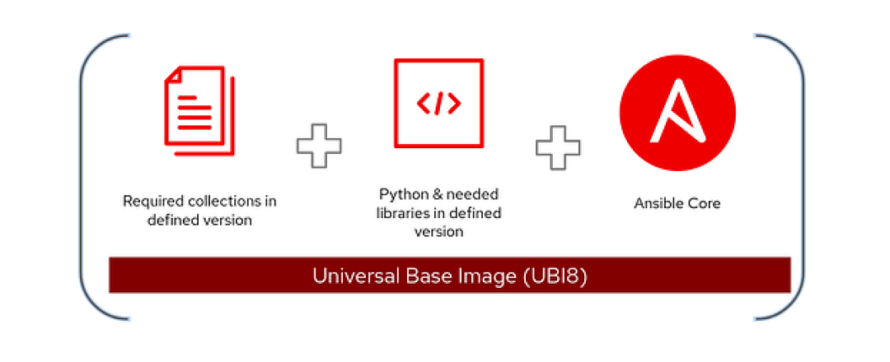
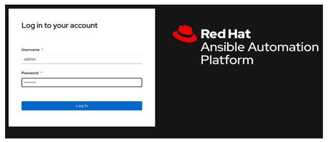
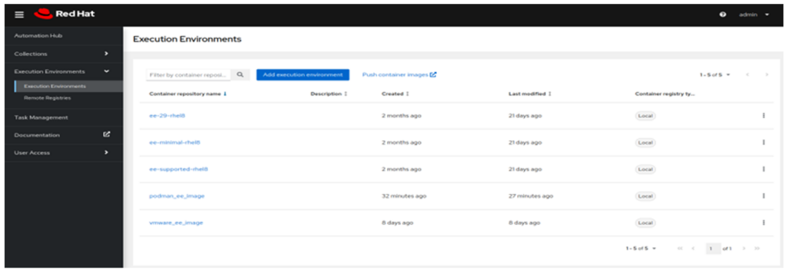
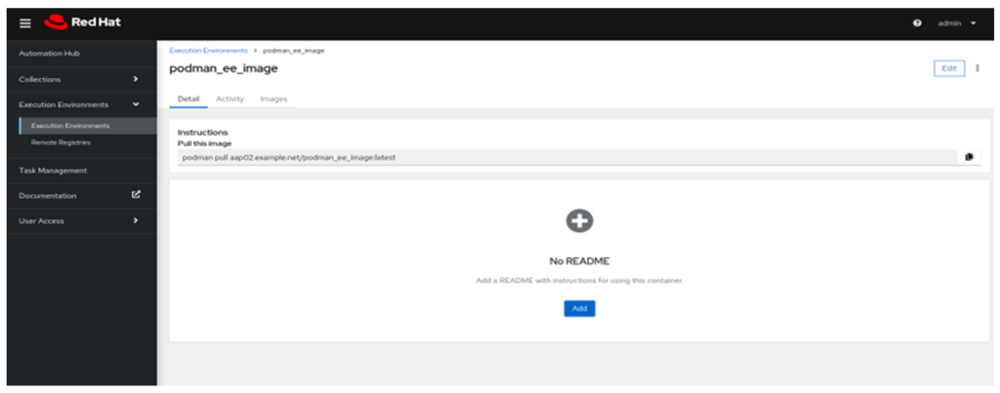
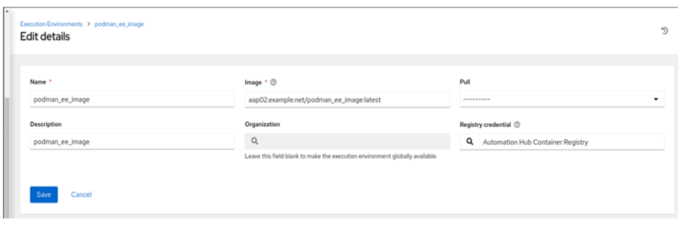
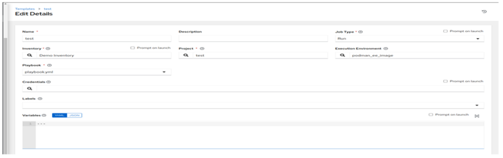
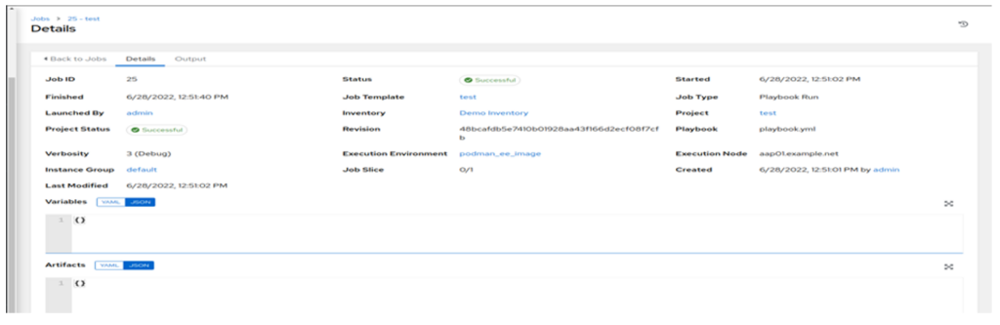

[Ansible execution environments (EE)](https://www.ansible.com/products/execution-environments) were introduced in [Ansible Automation Platform 2](https://www.redhat.com/en/resources/ansible-automation-platform-2-ebook?intcmp=701f20000012ngPAAQ) to provide a defined, consistent and portable environment for executing automation jobs. Execution environments are basically [Linux container](http://www.redhat.com/en/topics/containers?intcmp=701f20000012ngPAAQ) images that help execute Ansible playbooks.

## Execution environment components

The container images for the execution environments contain the necessary components to execute Ansible automation jobs. These include Python, Ansible (ansible-core), [Ansible Runner](https://ansible-runner.readthedocs.io/en/stable/), required Python libraries, and dependencies.




## Use ansible-builder to create a custom execution environment

Ansible Automation Platform's default container images let you start doing automation without any additional configurations. If your automation requires additional libraries or plugins, you can build custom container images and store them inside any supported container registry, such as [private automation hub](https://www.ansible.com/blog/8-private-automation-hub-features-about-automation-execution-environments).

You can follow the standard container image build process for building execution environment container images, but Ansible Automation Platform also includes a command-line utility called `ansible-builder` to build container images for custom execution environments. The `ansible-builder` tool can be installed from the upstream Python repository or the Red Hat RPM repository:

```shell
## Install ansible-builder utility
$ pip3 install ansible-builder
 
## Ansible Automation Platform repository subscription is required
$ sudo dnf install ansible-builder
```

## EE tutorial 


## Installation

  

The easiest way to install the ansible-builder is to run the following command:

  

(Note: If you have Ansible Automation Platform Hub nodes, the builder should be already installed there.)

  

```

pip3 install ansible-builder        

```

  

## How to Create Ansible Builder Definition

  

The “definition” in the realm of Ansible Builder is a YAML file which lists the dependencies at the Collection-level, the base image source and additional components which have to be overridden in the Execution Environment. The definition file is used as the input argument by the ansible-builder build command. It outputs the build context required to create an Execution Environment image, which is then utilised to actually build the final image. The same build context created during the build can be shared with other users to create environments with specific Ansible Collections.

  

The following example presents a definition file:

  

```

---

version: 1

dependencies:

  galaxy: requirements.yml

  python: requirements.txt

  system: bindep.txt

additional_build_steps:

  prepend: |

    RUN pip3 install --upgrade pip setuptools

  append:

    - RUN ls -la /etc

```

  

The ansible-builder build command will default to execution-environment.yml file. To override this behaviour, specify a different definition file, using -f (or —file) flag.

  

The elements which would be listed in the dependencies section might either be an absolute path or a relative path from the directory of the Execution Environment definition’s folder.

  

-   The following example requirements.yml file is a legitimate requirements file for the ansible-galaxy collection instal -r… command, and it contains the following information:

  

```

---

collections:

  - ansible.posix

  - containers.podman

```

  

-   You can verify the file’s configuration using the following command on a test server/workstation:

  

```

ansible-galaxy collection install -r requirements.yml

```

  

-   A Python requirements file for pip instal -r is referenced by the python entry under dependencies. The requirements.txt file might, for instance, have the following information:

  

```

# requirements.txt

psutil

ansible >= 2.13

firewall >= 0.2

```

  

In essence, all the collections’ python dependencies should be added to the requirements.txt file. The python dependencies can be found on the Ansible page describing given module/collection.         

  

Similarly, to collections, it is possible to test the file using pip3 install -r requirements.txt

  

If there are any cross-platform requirements, they will be specified in the bindep requirements file. These are handled by bindep before being forwarded to dnf.

  

```

gcc

python3-libselinux [platform:redhat]

python3            [platform:dpkg]

```

  

The additional build steps section allows you to specify additional commands you can run either before (prepend) or after (append) the main build steps. The syntax must be either a list (as demonstrated by the sample definition file’s append section) or a multi-line text (as demonstrated in the prepend section).

  

```

---

version: 1

dependencies:

  galaxy: requirements.yml

  python: requirements.txt

  system: bindep.txt

additional_build_steps:

  prepend: |

    RUN pip3 install --upgrade pip setuptools

  append:

    - RUN ls -la /etc

```

  

## Start the Build

  

Let’s run the build command and see what happens! The following execution-environment.yml file will be used to build an execution image with collections required to manage podman containers and to use ansible posix modules.

  

Ideally, you will create a separate directory with all the files described above. The following command will default to the execution-environment.yml file. The tag indicates the name of the image going to be built.  

(Note: On Fedora and Red Hat servers, the ansible-builder will default to podman container engine. If another runtime should be used, it can be specific with —container-runtime switch: —container-runtime docker.)

  

```

Let's run the build command and see what happens! The following execution-environment.yml file will be used to build an execution image with collections required to manage podman containers and to use ansible posix modules.

Ideally, you will create a separate directory with all the files described above. The following command will default to the execution-environment.yml file. The tag indicates the name of the image going to be built.

(Note: On Fedora and Red Hat servers, the ansible-builder will default to podman container engine. If another runtime should be used, it can be specific with —container-runtime switch: —container-runtime docker.)

```

## Example command 

``` bash
ansible-builder build -f <file_name>.yml --tag name-<name>:<tag_name> --container-runtime podman -v 3
```

``` bash
ansible-builder build -f ee.yml --tag name-obi-ee:test --container-runtime podman -v 3
```


-   Once the image is built, it can be verified by using the following command:


```
[root@aap01 builder-firewalld-container]# podman images

REPOSITORY                       TAG         IMAGE ID      CREATED         SIZE

localhost/podman_ee_image        latest      bffa0e361ef8  28 minutes ago  1.38 GB

<none>                           <none>      b45f24b19dd2  30 minutes ago  1.39 GB

<none>                           <none>      660c1af33d3b  32 minutes ago  819 MB

<none>                           <none>      9e080b619dd9  47 minutes ago  782 MB

<none>                           <none>      11cb3941f6c4  47 minutes ago  819 MB

<none>                           <none>      a961697e193a  53 minutes ago  782 MB

<none>                           <none>      54d20e308bfd  54 minutes ago  819 MB

localhost/vmware_ee_image        latest      591c14387c0a  8 days ago      1.68 GB

<none>                           <none>      38a134fd1b95  8 days ago      1.72 GB

<none>                           <none>      89b0325abbfd  8 days ago      824 MB

quay.io/ansible/ansible-runner   latest      bec0dc171168  2 months ago    816 MB

quay.io/ansible/ansible-builder  latest      b0348faa7f41  4 months ago    779 MB

```

  

-   If you are interested in how the image was put together, you can use the following command:

  

```

podman inspect localhost/podman_ee_image

```

  

-   As you can see in the output above, the podman\_ee\_image has been successfully built. In case you have the Ansible Automation Hub node, you can use the following command to push it to the Hub:

  

```

podman login aap02.example.net

podman push <Image Id> aap02.example.net/podman_ee_image

podman push bffa0e361ef8 aap02.example.net/podman_ee_image

Getting image source signatures

Copying blob aadc47c09f66 skipped: already exists  

Copying blob e0808177f5c4 skipped: already exists  

Copying blob 699491b2659e skipped: already exists  

Copying blob 6da2fb060681 skipped: already exists  

Copying blob 5fa5c1c78a8e skipped: already exists  

Copying blob 101e6c349551 skipped: already exists  

Copying blob f8fd3a54d485 skipped: already exists  

Copying blob d4df4b7e8eaf skipped: already exists  

Copying blob 7dfd83b5170b skipped: already exists  

Copying blob 32ad5db2dab5 skipped: already exists  

Copying blob aa621dba5e87 skipped: already exists  

Copying blob d32c18715b98 skipped: already exists  

Copying blob a39c6baf08b1 skipped: already exists  

Copying blob 1d211ae75d27 skipped: already exists  

Copying blob 869dbc4797e2 skipped: already exists  

Copying blob c3eeed63d6a9 skipped: already exists  

Copying blob 2d4417eff75b skipped: already exists  

Copying blob 22e51cce938f skipped: already exists  

Copying blob 0e35fc86ad8c skipped: already exists  

Copying blob 73373610159e skipped: already exists  

Copying blob de0c9bd7ced9 skipped: already exists  

Copying blob 5f70bf18a086 skipped: already exists  

Copying config bffa0e361e done  

Writing manifest to image destination

Storing signatures

```

-   Verify if the image is visible in the AAP Hub’s configuration. Open the browser and navigate to your hub’s address:

  



  

-   In the Automation Hub, navigate to ‘Execution Environments’ > ‘Execution Environments’ and verify if podman\_ee\_image is visible:

  



  

The image is available.

  

-   Click on the image and navigate to the ‘Detail’ tab as indicated below:

  



  

-   Copy the image name after ‘podman pull’:

  

```

aap02.example.net/podman_ee_image:latest

```

  

You will use it to configure the Execution Environment on the controller.

  

-   Log into the Ansible Automation Controller node as admin and navigate to ‘Administration’ > ‘Execution Environments’. Click ‘Add’ and input the following configuration:

  



  

-   Click ‘Save’.

-   To use the image in the Template, navigate to the template with the playbook/role utilising the collections specified in the playbook and select ‘Execution Environment’:

  



  

-   Save the configuration and launch the job. The first run might take more time as the controller will need to pull the execution image:

  

 

 ## Steps to push an EE to automation hub 

```
podman login

build image

tag it

then push
```


```
[root@ip-10-1-4-0 ansible-execution-environment-image]# podman tag localhost/obi:test [10.1.12.246/localhost/obi:test](http://10.1.12.246/localhost/obi:test)

[root@ip-10-1-4-0 ansible-execution-environment-image]# podman push --tls-verify=true [10.1.12.246/localhost/obi:test](http://10.1.12.246/localhost/obi:test) 
Getting image source signatures 
Copying blob 699491b2659e done   
Copying blob 4ebff3f08afd skipped: already exists   
Copying blob 4bcff2e2f6f9 skipped: already exists  
Copying blob 058590a69630 skipped: already exists   
Copying blob 77b5c4e58e89 skipped: already exists   
Copying blob 388a082a88be skipped: already exists   
Copying blob 6230698dbc0c skipped: already exists   
Copying blob 6eaac70676cf skipped: already exists   
Copying blob f88f956bd081 skipped: already exists   
Copying blob 04f70e07894c skipped: already exists   
Copying blob cf1ed96a68ef skipped: already exists   
Copying blob 795a42738d69 skipped: already exists   
Copying blob a0018c9f7a06 skipped: already exists   
Copying blob a86d61c08329 skipped: already exists   
Copying blob d20dbd7c7091 skipped: already exists   
Copying blob 07110f5ca1c7 skipped: already exists   
opying blob 3131e7e4b016 skipped: already exists   
Copying blob f568239094eb skipped: already exists   
Copying blob de0703d453b2 skipped: already exists   
Copying blob 228250a1610f skipped: already exists   
Copying blob badb1ebccd19 skipped: already exists   
Copying blob 463d2b169b67 skipped: already exists   
Copying blob 2301e0da36c6 skipped: already exists   
Copying blob bccc06fe03eb skipped: already exists   
Copying blob 75145b5faa9d skipped: already exists  
Copying config 587f82058b done   
Writing manifest to image destination 
Storing signatures

```


