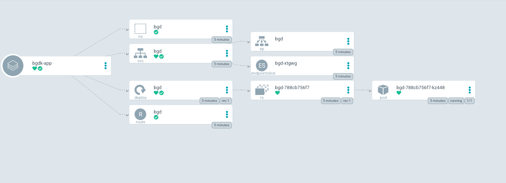
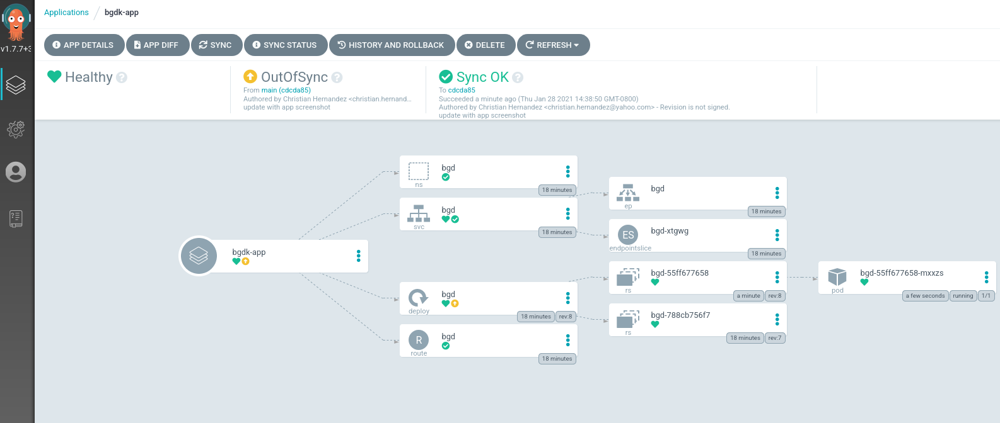
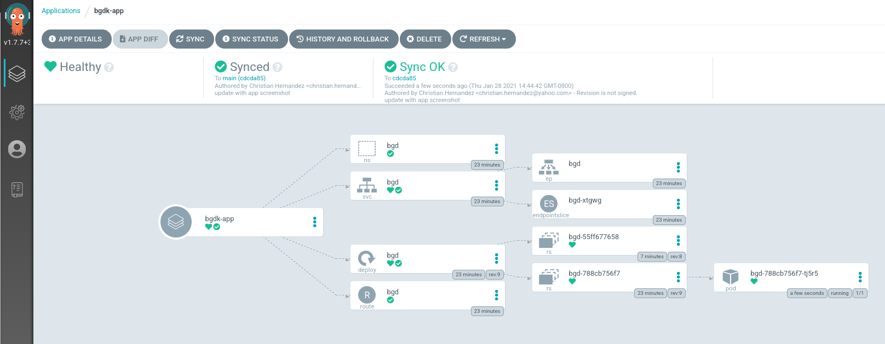

[[Index]] 
### [](https://redhat-scholars.github.io/argocd-tutorial/argocd-tutorial/02-getting_started.html#_review_the_application_manifests)Review the Application Manifests


GitOps is a set of practices and principles that aims to streamline and automate the deployment and management of applications and infrastructure using Git as the single source of truth. It encourages the idea that the entire desired state of a system should be stored in a Git repository, and any changes to the system should be made through Git commits and pull requests. This approach brings version control, collaboration, and audibility to the process of managing and deploying applications and infrastructure.

***Think config-as-code deployed straight from repo***

Argo CD is a popular GitOps tool that helps automate the deployment and lifecycle management of applications on Kubernetes clusters. It enables declarative, Git-based configuration for your applications and ensures that the actual state of the system matches the desired state defined in your Git repository. Argo CD continuously monitors the repository for changes and synchronizes the cluster with any updates, making it easier to maintain consistency and reduce manual interventions.

OpenShift is a container platform developed by Red Hat that provides a Kubernetes distribution with added features and tools for simplifying the deployment, management, and scaling of containerized applications. OpenShift can also be integrated with GitOps practices using tools like Argo CD. This integration allows you to manage the deployment and configuration of applications on OpenShift clusters through Git repositories, making it easier to maintain and automate the application lifecycle.

In summary, GitOps is a methodology for managing infrastructure and application deployments using Git as the source of truth, while Argo CD is a tool that helps implement GitOps practices for Kubernetes environments, including those based on OpenShift. This combination can enhance the consistency, traceability, and efficiency of managing applications in complex containerized environments.


The application manifests include a Namespace, Deployment, and networking manifests for Minikube/OpenShift. Deploying these manifests to a cluster will result in an application that supports ingress.

<table><tbody><tr><td><i title="Important"></i></td><td><p>Review, but do not apply these manifests to your cluster. We will do that shortly using Argo CD.</p></td></tr></tbody></table>

A **Namespace**:

```
apiVersion: v1
kind: Namespace
metadata:
  name: bgd
spec: {}
status: {}
```

A **Deployment**:

```
---
apiVersion: apps/v1
kind: Deployment
metadata:
  labels:
    app: bgd
  name: bgd
  namespace: bgd
spec:
  replicas: 1
  selector:
    matchLabels:
      app: bgd
  strategy: {}
  template:
    metadata:
      labels:
        app: bgd
    spec:
      containers:
      - image: quay.io/redhatworkshops/bgd:latest
        name: bgd
        env:
        - name: COLOR
          value: "blue"
        resources: {}
---
```

-   Minikube
    
-   OpenShift
    

A **Service** of type `NodePort`:

```
---
apiVersion: v1
kind: Service
metadata:
  labels:
    app: bgd
  name: bgd
  namespace: bgd
spec:
  type: NodePort
  ports:
  - port: 8080
    protocol: TCP
    targetPort: 8080
  selector:
    app: bgd
---
```

An **Ingress**:

```
apiVersion: networking.k8s.io/v1
kind: Ingress
metadata:
  name: bgd
spec:
  rules:
    - host: bgd.devnation
      http:
        paths:
          - path: /
            pathType: Prefix
            backend:
              service:
                name: bgd
                port:
                  number: 8080
```

A **Service** of type `ClusterIP`:

```
---
apiVersion: v1
kind: Service
metadata:
  creationTimestamp: null
  labels:
    app: bgd
  name: bgd
  namespace: bgd
spec:
  ports:
  - port: 8080
    protocol: TCP
    targetPort: 8080
  selector:
    app: bgd
---
```

A **Route**:

```
apiVersion: route.openshift.io/v1
kind: Route
metadata:
  labels:
    app: bgd
  name: bgd
  namespace: bgd
spec:
  port:
    targetPort: 8080
  to:
    kind: Service
    name: bgd
    weight: 100
```

### [](https://redhat-scholars.github.io/argocd-tutorial/argocd-tutorial/02-getting_started.html#_deploy_the_application)Deploy the Application

A managed collection of manifests is known as an `Application` within Argo CD. Therefore, you must define it as such using an [Application CR (CustomResource)](https://argo-cd.readthedocs.io/en/stable/operator-manual/declarative-setup/#applications) in order to have Argo CD apply these manifests in your cluster.

-   Minikube
    
-   OpenShift
    

<table><tbody><tr><td><i data-value="1"></i><b>1</b></td><td>The destination server is the same server we installed Argo CD on.</td></tr><tr><td><i data-value="2"></i><b>2</b></td><td>Here you’re installing the application in Argo CD’s <code>default</code> project (<code>.spec.project</code>).</td></tr><tr><td><i data-value="3"></i><b>3</b></td><td>The manifest repo, and the path within it where the YAML resides.</td></tr><tr><td><i data-value="4"></i><b>4</b></td><td>The <code>syncPolicy</code> is set to <code>automated</code>. It will automatically prune resources resources that have been removed from the Git repo, but will not automatically correct resources that deviate from the definition stored in the repo, i.e manual changes use <code>kubectl</code> will not be "healed".</td></tr></tbody></table>

Apply the Application CR by running the following command:

```
kubectl apply -f documentation/modules/ROOT/examples/minikube/bgd-app/bgd-app.yaml
```

<table><tbody><tr><td><i data-value="1"></i><b>1</b></td><td>The destination server is the same server we installed Argo CD on.</td></tr><tr><td><i data-value="2"></i><b>2</b></td><td>Here you’re installing the application in Argo CD’s <code>default</code> project (<code>.spec.project</code>).<div><table><tbody><tr><td><i title="Note"></i></td><td>Argo CD’s concept of a <code>Project</code> is different than OpenShift’s. Here you’re installing the application in Argo CD’s <code>default</code> project (<code>.spec.project</code>). <strong>NOT</strong> OpenShift’s default project.</td></tr></tbody></table></div></td></tr><tr><td><i data-value="3"></i><b>3</b></td><td>The manifest repo, and th path within it where the YAML resides.</td></tr><tr><td><i data-value="4"></i><b>4</b></td><td>The <code>syncPolicy</code> is set to <code>automated</code>. It will automatically prune resources resources that have been removed from the Git repo, but will not automatically correct resources that deviate from the definition stored in the repo, i.e manual changes made using <code>kubectl</code> will not be "healed".</td></tr></tbody></table>

Apply the Application CR by running the following command:

```
kubectl apply -f documentation/modules/ROOT/examples/bgd-app/bgd-app.yaml
```

The newly created Application appears as a tile with the title `bgd-app` in the Argo CD UI.


Clicking on this tile takes you to the application details page. You may see it as still progressing or fully synced.



<table><tbody><tr><td><i title="Note"></i></td><td>You may have to click on <code>show hidden resources</code> on this page to see all of the resources.</td></tr></tbody></table>

At this point the application should be up and running. Verify that the resources were created:

The output should list a Service, Deployment, and Pod:

```
NAME                       READY   STATUS    RESTARTS   AGE
pod/bgd-788cb756f7-kz448   1/1     Running   0          10m

NAME          TYPE        CLUSTER-IP       EXTERNAL-IP   PORT(S)    AGE
service/bgd   ClusterIP   172.30.111.118   <none>        8080/TCP   10m

NAME                  READY   UP-TO-DATE   AVAILABLE   AGE
deployment.apps/bgd   1/1     1            1           10m
```

Verify the the rollout is complete:

```
kubectl rollout status deploy/bgd -n bgd
```

Obtain the URL, and visit your application in a web browser:

-   Minikube
    
-   OpenShift
    

Add Minikube IP (`minikube ip`) and the Ingress hostname `bgd.devnation` to your Host file, like `/etc/hosts`.

Example:

```
192.168.39.242 bgd.devnation
```

From **Web Console**, select **bgd** project from drop-down menu, then click to the application’s Route to access it.


Alternatively, get app Route from CLI:

```
oc get route bgd -n bgd -o jsonpath='{.spec.host}{"\n"}'
```

Your application should look like this.


### [](https://redhat-scholars.github.io/argocd-tutorial/argocd-tutorial/02-getting_started.html#_addressing_configuration_drift)Addressing Configuration Drift

Let’s introduce a change in the application environment! Patch the live Deployment manifest to change the color of the bubbles in the application from blue to green:

```
kubectl -n bgd patch deploy/bgd --type='json' -p='[{"op": "replace", "path": "/spec/template/spec/containers/0/env/0/value", "value":"green"}]'
```

Wait for the rollout to happen:

```
kubectl rollout status deploy/bgd -n bgd
```

Refresh the tab where your application is running. You should see green bubbles.


Looking over at your Argo CD Web UI, you can see that Argo detects your application as "Out of Sync".



You can sync your app via the Argo CD by:

-   First clicking `SYNC`
    
-   Then clicking `SYNCHRONIZE`
    

Alternatively, you can run the following command:

After the sync process is done, the Argo CD UI should mark the application as in sync.



Reload the page on the tab where the application is running. The bubbles should have returned to their original blue color.


You can setup Argo CD to automatically correct drift by setting the `Application` manifest to do so. Example:

```
spec:
  syncPolicy:
    automated:
      prune: true
      selfHeal: true
```

Or, as in our case, after the fact by running the following command:

-   Minikube
    
-   OpenShift
    

```
kubectl patch application/bgd-app -n argocd --type=merge -p='{"spec":{"syncPolicy":{"automated":{"prune":true,"selfHeal":true}}}}'
```

```
kubectl patch application/bgd-app -n openshift-gitops --type=merge -p='{"spec":{"syncPolicy":{"automated":{"prune":true,"selfHeal":true}}}}'
```