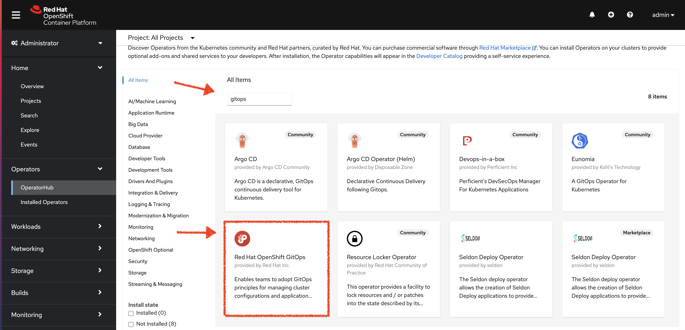
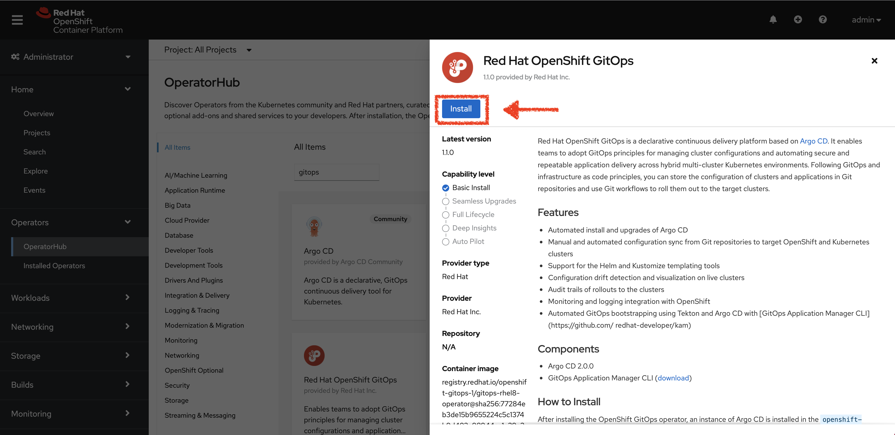
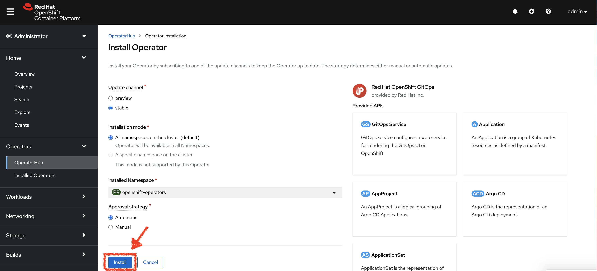
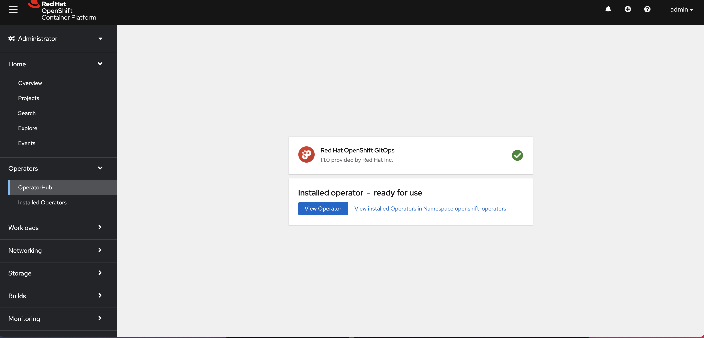
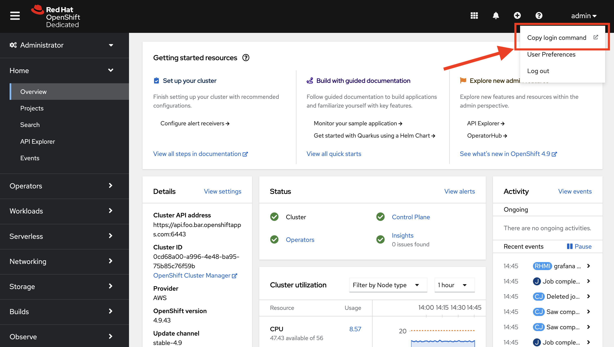

[[Index]]  [[ArgoCD Tutorial]] 
## [](https://redhat-scholars.github.io/argocd-tutorial/argocd-tutorial/01-setup.html#downloadtutorial)Download Tutorial Source Files

Before we start setting up the environment, let’s clone the tutorial sources and set the `TUTORIAL_HOME` environment variable to point to the root directory of the tutorial:

```
export TUTORIAL_HOME="$(pwd)/gitops"
```

## [](https://redhat-scholars.github.io/argocd-tutorial/argocd-tutorial/01-setup.html#kubernetes)Setup OpenShift / Kubernetes Cluster

The profile gitops is created to run the tutorial:

-   Minikube
    
-   OpenShift
    

Having `minikube` installed and in your `PATH`, then run:

**MacOS**

```
minikube start --memory=8192 --cpus=3 --kubernetes-version=v1.20.2 --vm-driver=virtualbox -p gitops
```

**Linux**

```
minikube start --memory=8192 --cpus=3 --kubernetes-version=v1.20.2 --vm-driver=kvm2 -p gitops
```

**Windows:**

```
minikube start --memory=8192 --cpus=3 --kubernetes-version=v1.20.2 --vm-driver=hyperv -p gitops
```

And the output must be something similar like:

```
😄  [gitops] minikube v1.20.0 on Darwin 11.3
✅  Created a new profile : gitops
✅  minikube profile was successfully set to gitops
😄  [default] minikube v1.20.0 on Darwin 11.3
✨  Selecting 'virtualbox' driver from user configuration (alternates: [hyperkit])
🔥  Creating virtualbox VM (CPUs=2, Memory=8192MB, Disk=50000MB) ...
🐳  Preparing Kubernetes v1.20.2 on Docker '20.10.6' ...
    ▪ apiserver.enable-admission-plugins=LimitRanger,NamespaceExists,NamespaceLifecycle,ResourceQuota,ServiceAccount,DefaultStorageClass,MutatingAdmissionWebhook
🚜  Pulling images ...
🚀  Launching Kubernetes ...
⌛  Waiting for cluster to come online ...
🏄  Done! kubectl is now configured to use "gitops"
```

Finally configure to use minikube internal docker as docker host:

```
eval $(minikube docker-env -p gitops)
```

To run OpenShift4, you need to have one provisioned using [try.openshift.com](https://try.openshift.com/) or can use any existing OpenShift4 cluster. Once you have your cluster, you can download the latest OpenShift client(oc) from [here](https://mirror.openshift.com/pub/openshift-v4/clients/ocp/latest/) and add to your path.

You can check the OpenShift version using:

The output should show oc version >=4.7:

```
Client Version: 4.7.0-202102130115.p0-c66c03f
Kubernetes Version: v1.20.2
```

Then login into the OpenShift cluster using `oc login`

Now you’re ready to install Argo CD on Kubernetes.

## [](https://redhat-scholars.github.io/argocd-tutorial/argocd-tutorial/01-setup.html#install_argocd)Argo CD Installation

In this section we will be exploring how to install Argo CD on Minikube, and how to install it on OpenShift with the OpenShift GitOps Operator.

-   Minikube
    
-   OpenShift
    

In the minikube guide, an Argo CD upstream deployment will be installed and used.

Enable the Ingress Addon for Minikube:

```
minikube addons enable ingress -p gitops
```

Check that the addon has been enabled:

```
🌟  The 'ingress' addon is enabled
```

Install ArgoCD and check that every pod is running properly in the argocd namespace:

<table><tbody><tr><td><i title="Note"></i></td><td><p>It will take few mins for the ArgoCD components to be installed, you can watch the status using the command:</p><div><pre><code data-lang="bash">watch kubectl get pods -n argocd</code></pre></div><p>You can use <span><kbd>Ctrl</kbd>+<kbd>c</kbd></span> to terminate the watch</p></td></tr></tbody></table>

A successful deployment of ArgoCD will show the following pods:

```bash
NAME                                  READY   STATUS    RESTARTS   AGE
argocd-application-controller-0       1/1     Running   0          2m18s
argocd-dex-server-5dd657bd9-2r24r     1/1     Running   0          2m19s
argocd-redis-759b6bc7f4-bnljg         1/1     Running   0          2m19s
argocd-repo-server-6c495f858f-p5267   1/1     Running   0          2m18s
argocd-server-859b4b5578-cv2qx        1/1     Running   0          2m18s
```

Patch the ArgoCD service from ClusterIP to a LoadBalancer:

```bash
kubectl patch svc argocd-server -n argocd -p '{"spec": {"type": "LoadBalancer"}}'
```

Now with the minikube service list you can check the argocd service exposed:

```bash
minikube -p gitops service list | grep argocd
```


ArgoCD is supported in OpenShift 4.7 by **Red Hat OpenShift GitOps** operator.

<table><tbody><tr><td><i title="Note"></i></td><td><p>The ability to install Operators is limited to users with the <code>cluster-admin</code> role assigned to them. Make sure to login as a user with the necessary privileges to install the Operator.</p></td></tr></tbody></table>

1.  Switch to the **Administrator perspective** in the OpenShift web console.
    
2.  Navigate to **Operators** → **OperatorHub** using the menu on the left.
    
3.  Search for OpenShift GitOps in OperatorHub.
    
    
    
4.  Click the **Red Hat OpenShift GitOps** tile.
    
5.  Select the **Stable** channel.
    
    
    
6.  Click the **Install** button.
    
    
    
7.  Wait for the installation process to complete.
    
    
    
8.  Login to the cluster using the `oc` client. You can copy a login command from the OpenShift web console:
    
    
    
9.  Verify that all the required Pods have been deployed in `openshift-gitops` namespace using the following command:
    
```bash
    oc get pods -n openshift-gitops
```
    
    The output should show a list of Pods similar to this:
    
```bash
    NAME                                                    READY   STATUS    RESTARTS   AGE
    argocd-cluster-application-controller-6f548f74b-48bvf   1/1     Running   0          54s
    argocd-cluster-redis-6cf68d494d-9qqq4                   1/1     Running   0          54s
    argocd-cluster-repo-server-85b9d68f9b-4hj52             1/1     Running   0          54s
    argocd-cluster-server-78467b647-8lcv9                   1/1     Running   0          54s
    cluster-86f8d97979-lfdhv                                1/1     Running   0          56s
    kam-7ff6f58c-2jxkm                                      1/1     Running   0          55s
 ```
    
10.  Verify that the Operator is listed when you issue the following command:
    
    This should have the following output.
    
```bash
    NAME                                                  AGE
    openshift-gitops-operator.openshift-operators         25m
    openshift-pipelines-operator-rh.openshift-operators   25m
 ```
    
11.  Give the ServiceAccount for ArgoCD the ability to manage the cluster:
    
```bash
    oc adm policy add-cluster-role-to-user cluster-admin -z openshift-gitops-argocd-application-controller -n openshift-gitops
```
    

That’s it! You learned how to install an Operator on OpenShift using OperatorHub, and how to use administrative commands via `oc adm` to apply cluster roles to users.