[[Index]] 

[[Redhat Image Builder - Full Tutorial]] 

[[Red Hat Image Builder Blueprint examples continued]]   

[[Red Hat Image Builder OS Build Notes - TOML Templates]] 

[[Red Hat Image Builder -UI]] 

---
created: 2023-04-24T23:04:30 (UTC +01:00)
tags: []
source: https://www.redhat.com/sysadmin/rhel-image-builder
author: Eric "IT Guy" Hendricks
---

# How to install RHEL a new way with image builder | Enable Sysadmin

> ## Excerpt
> Red Hat Enterprise Linux's image builder service saves time and reduces complexity when deploying optimized systems across datacenters and cloud footprints.

---
Posted: July 11, 2022 %t min read

I am sure many sysadmins can relate to this scenario:

You get into work on Monday morning, attend your staff meeting, and log into your ticketing system, expecting a quiet week. NOPE! Right there in all caps (why do people use all caps in a ticket?) and marked **Urgent** is a request for a new application environment. Of course, the requester needs the new server up and running by the end of the week.

You are a savvy sysadmin. No problem, right? How hard could it be to deploy a new server with a database and web server? You thought ahead. You have templates for these things!

**_\[ Want more on this topic? Watch the full session, [The new way to Install Red Hat Enterprise Linux: Image Builder service](https://events.experiences.redhat.com/widget/redhat/sum22/SessionCatalog22/session/1641398669945001iy8u), on-demand from Red Hat Summit. \]_**

Then that database server you spent all weekend trying to fix crashed again. That took all day. Tuesday was that company all-hands meeting. Wednesday, more meetings and fires. Now it's nearly Friday. That urgent ticket with its all caps glares at you every time you log in to update a ticket.

Time to be a hero! You close your email, mark your calendar as busy, and put on your headphones. You deploy your production template, but uh oh, that one is three minor versions behind.

So you check the one on your laptop. That one is running the latest version, woot, but nope, that one is running the "old" security tool. In desperation, you log in to your [private cloud](http://www.redhat.com/en/topics/cloud-computing/what-is-private-cloud?intcmp=701f20000012ngPAAQ) (say OpenStack). You know that template is up to date, but something corrupted the boot image, so now you can't get a terminal.

In frustration, you return to your production image and just run the patches. You throw your hands up and add three new tickets to your queue to fix these out-of-date images.

## A new way to RHEL

If that feels familiar, you should connect with me on social media: [@itguyeric](https://twitter.com/itguyeric). I think it's about time we start a club, support group, or something. While that may be an amusing anecdote, it was true of my experience for a good chunk of my operations career. And not just for me, but for many of you who work in the trenches daily keeping companies, universities, and governments up and running.

Deploying an operating system is expensive. It costs resources (hardware or compute time) and something far more precious: the time and attention of a sysadmin.

Do not despair; those days of managing images across platforms, versions, and configurations are swiftly closing. The issue of template management is where image builder comes into play.

[Red Hat Enterprise Linux's (RHEL)](https://www.redhat.com/en/technologies/linux-platforms/enterprise-linux?intcmp=701f20000012ngPAAQ) image builder saves time and reduces complexity when deploying optimized systems across datacenters and cloud footprints.

Image builder comes in three flavors: command line, local install (on a RHEL host), or Red Hat's hosted service. No matter which flavor you choose, you'll be able to design optimized images for your targeted platforms: hardware, qcow2 or vmdk, or cloud image.

**_\[ Get hands on: [Build a RHEL image using the Red Hat Image Builder](https://cloud.redhat.com/learn/how-build-and-upload-red-hat-enterprise-linux-rhel-image-image-builder?intcmp=701f20000012ngPAAQ), then upload it to your chosen cloud service. \]_**

## RH Image Builder Workflow - Obi's Perspective
** Red Hat Image Builder sits on your server of choice (Cloud, vm, bare metal) 
   Your blueprint scripts live in source control until you do a git clone on your server 
   Make your customizations to the blueprint file and then push your changes to tool 
   Make sure the to build the image via CLI or UI 
   Make a decison wether you want to push the image to AWS also **

## Image builder workflow

You can break down the image builder process into five steps:

1.  Select your platform. Choose one of the three big cloud providers, a virtual image, or a hardware installer for servers or edge devices.
2.  Select your image builder tool. Choose between an on-premises build or the [hosted solution](https://console.redhat.com/?intcmp=701f20000012ngPAAQ).
3.  Create a blueprint. Define filesystems, select packages, and configure users.
4.  Build the image. Pick virtual, AWS, GCP, Azure, VMware, or ISO types.
5.  Deploy your instance. Not just one, either. Image builder helps create images to deploy anywhere, anytime.

**_\[ Free eBook: [Manage your Linux environment for success](https://www.redhat.com/en/engage/linux-management-ebook-s-201912231121?intcmp=701f20000012ngPAAQ). \]_**

## How does it work?

I sense some disbelief, so I'll walk through an example. And if you prefer to learn by watching, check out my video at the bottom of this article.

First, log in to the tool at [console.redhat.com](https://console.redhat.com/?intcmp=701f20000012ngPAAQ). Once you've logged in with your Red Hat Customer Portal account, navigate to **Red Hat Enterprise Linux** and select **Red Hat Insights**.

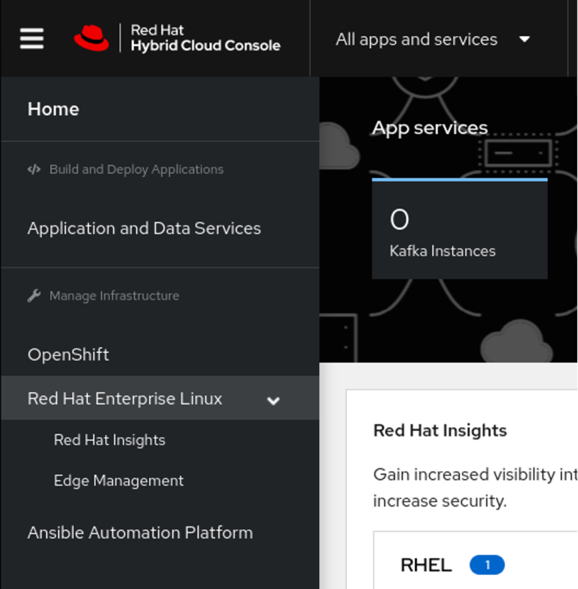

The link for **image builder** is toward the bottom of the Insights panel (or just navigate straight to the [tool](https://console.redhat.com/insights/image-builder)).

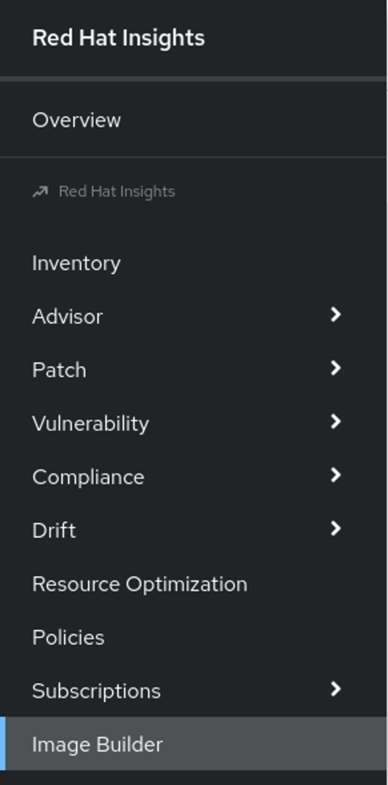

(Eric Hendricks, CC BY-SA 4.0)

Now you can begin to create a new image.

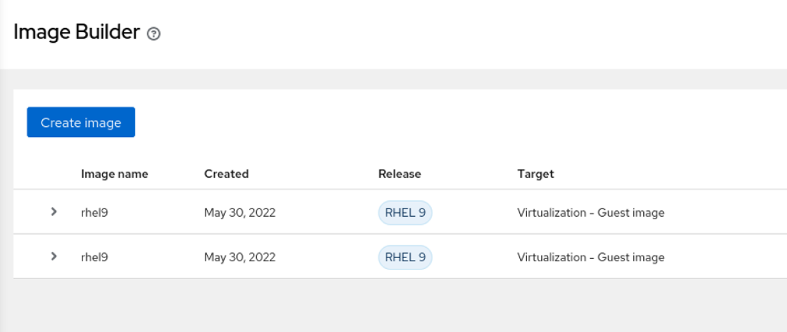

(Eric Hendricks, CC BY-SA 4.0)

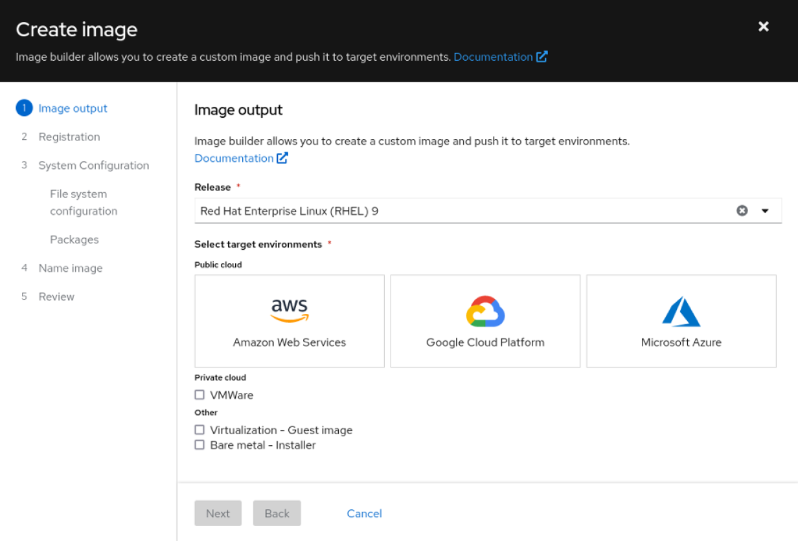

(Eric Hendricks, CC BY-SA 4.0)

From the **Create image** wizard, you define how your image will look. First, choose between RHEL major releases. Versions 8 and 9 are currently available on the hosted service. Next, decide what kind of image to build.

**_\[ Free download: [Advanced Linux commands cheat sheet](https://developers.redhat.com/cheat-sheets/advanced-linux-commands?intcmp=701f20000012ngPAAQ). \]_**

For this example, imagine you want to deploy a production instance on Google Cloud Platform (GCP) but also have a qcow2 file to do testing and development work from your local laptop.

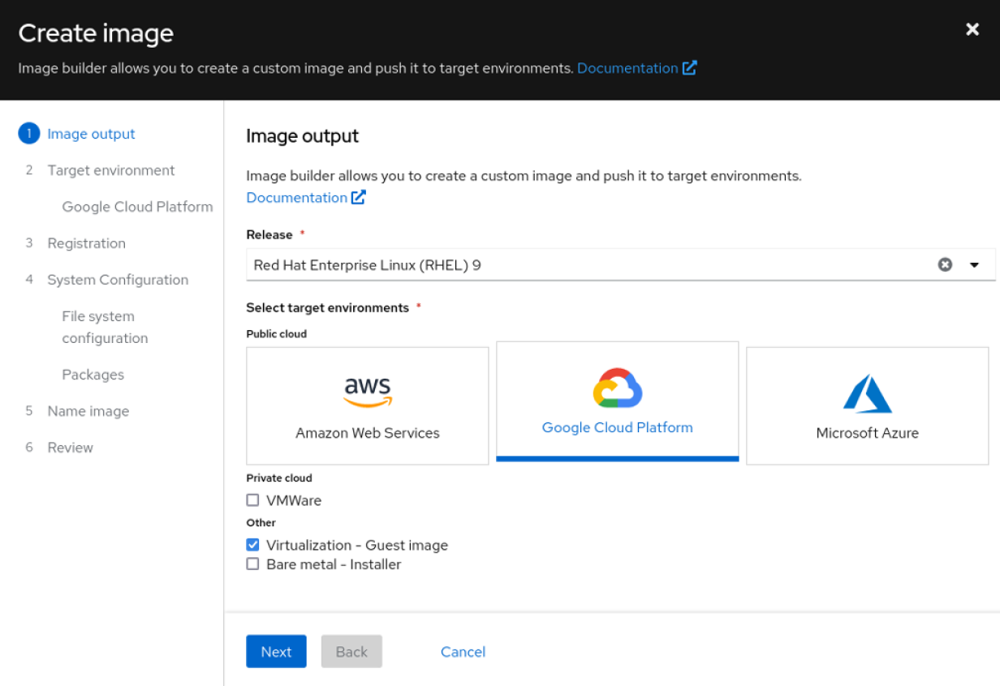

(Eric Hendricks, CC BY-SA 4.0)

Notice that when you select certain options, your breadcrumb trail adjusts to reflect the additional steps. For GCP, you can choose to share the template with a user account, a service account, a group account, or a domain. For this example, I will just share it with my Red Hat account on GCP.

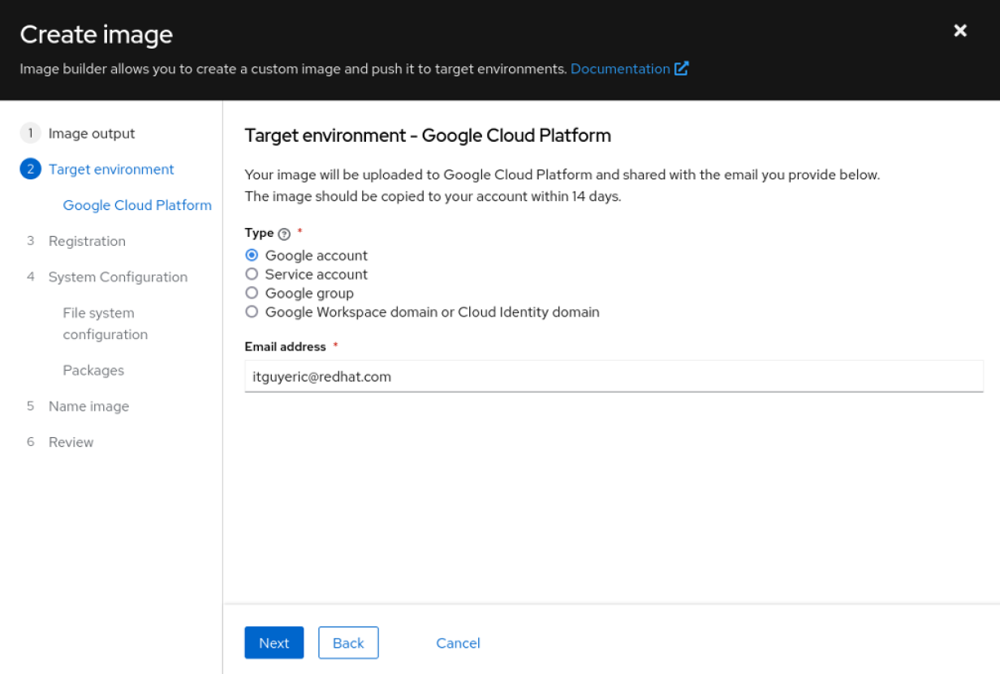

(Eric Hendricks, CC BY-SA 4.0)

Now, this is one of my favorite features: You can bake your registration into the image. All you need is a valid activation key setup in your customer portal. But that's not all; you can also preconfigure your image to register with Red Hat Insights right from the template.

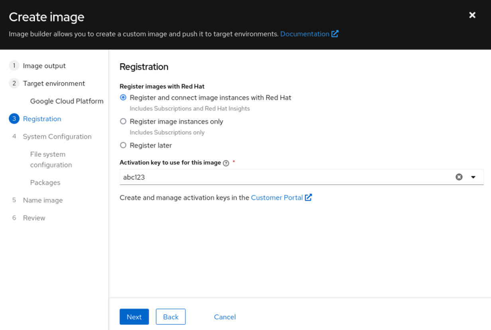

(Eric Hendricks, CC BY-SA 4.0)

One of the newest additions to the image builder tool is manually configured filesystems. You can now define sizes and locations for multiple partitions. For this example, I'll add a `home` partition, and also add a `webapp` directory under `opt`. I will set both of those to 5GB but leave the root at the default 10GB.

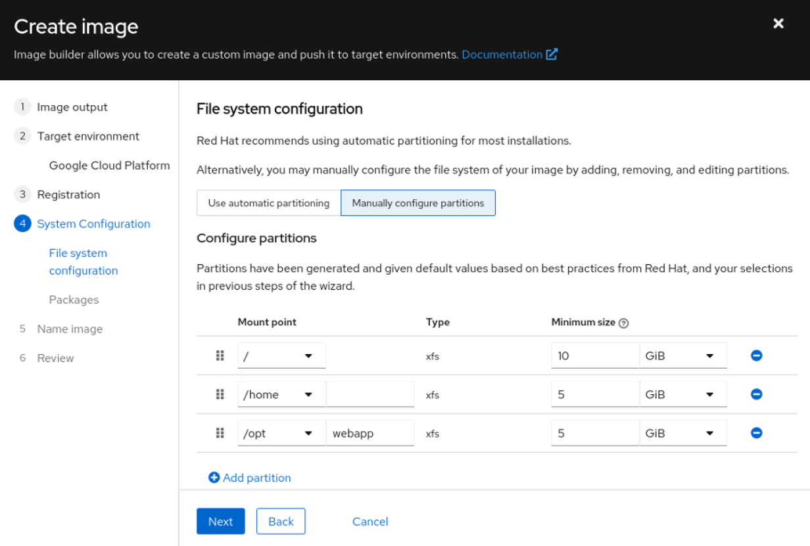

(Eric Hendricks, CC BY-SA 4.0)

Next stop, packages. There are literally thousands of packages available in the Red Hat repositories. You can add any combination of these packages to your image. For instance, I am a huge fan of [tmux](https://opensource.com/downloads/tmux-cheat-sheet?intcmp=701f20000012ngPAAQ), a terminal multiplexer. I mentioned this would be a web application, so I'll grab Nginx, too.

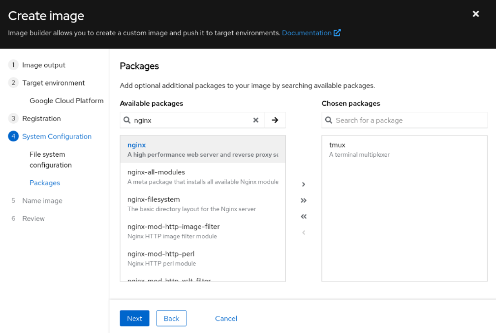

(Eric Hendricks, CC BY-SA 4.0)

What you cannot see from this menu is that image builder automatically added all the dependencies for tmux and Nginx to the image. That's over 100 packages that it added to the list without any intervention.

All that is left is to give your image a descriptive name and review the choices. Image builder does the rest.

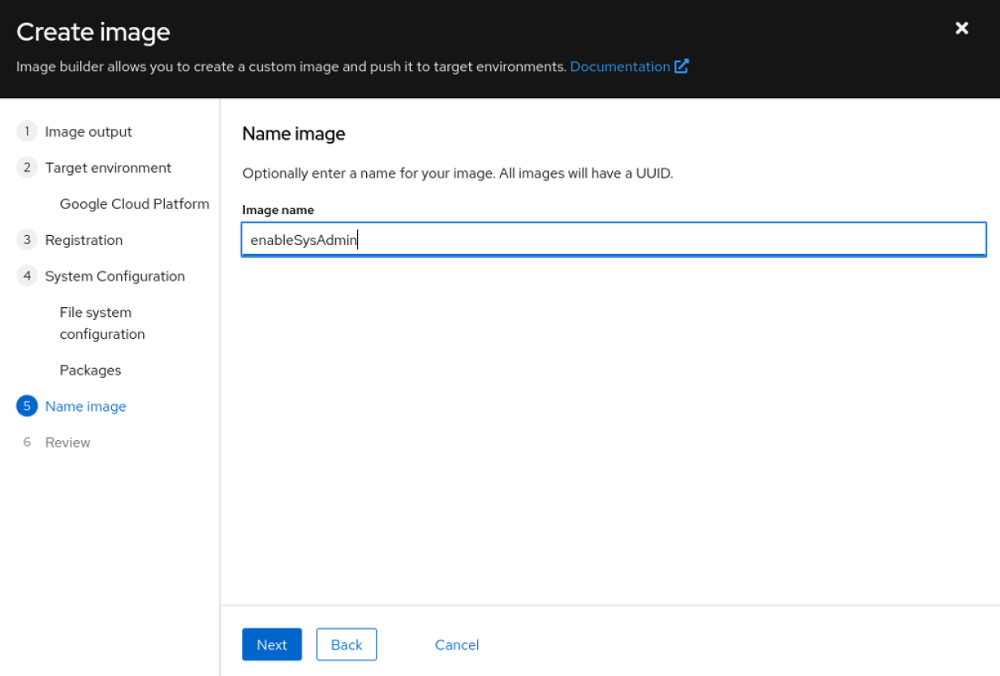

(Eric Hendricks, CC BY-SA 4.0)

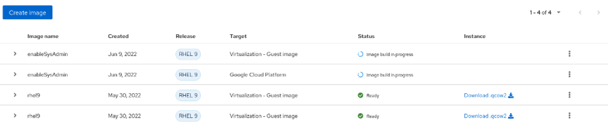

(Eric Hendricks, CC BY-SA 4.0)

Building an image varies greatly between how complex the image is, how large the actual image will be, and, like all shared services, how heavy of a load there is on the platform. In this demonstration, I saw between 10 and 18 minutes.

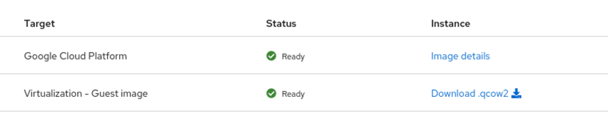

(Eric Hendricks, CC BY-SA 4.0)

Once the images are done building, you can start deploying them. For the qcow2 image, I received a link to download the file directly from my browser. You can then upload it to a file share or hypervisor, or import it into your laptop for local use. Your options will vary depending on your choices above.

You receive an image name for the GCP image that you can use to copy the template into your GCP account. You can use it just as you would any other cloud image.

(Eric Hendricks, CC BY-SA 4.0)

## Wrap up

This article may sound like an infomercial for image builder, but the process is that easy. I have used many different tools over the years: Documenting the process in text files, complicated Kickstart scripts, or VM templates. Image builder has been the easiest to incorporate into the workflow for my home lab and for the content I help develop for Red Hat Enterprise Linux.

With different platforms, formats, and combinations of settings, image builder quickly meets the needs of any number of operations projects.

Please don't take my word for it, though. Try it for yourself. Either visit the [hosted service](https://console.redhat.com/insights/image-builder) or try out our two Image Builder labs. The [first](https://lab.redhat.com/tracks/imagebuilder) is web console-based and the [second](https://lab.redhat.com/tracks/imagebuilder-cli) relies on the command line interface.

[[Index]]

[[Redhat Image Builder - Full Tutorial]] 

[[Red Hat Image Builder Blueprint examples continued]] 

[[Red Hat Image Builder OS Build Notes - TOML Templates]] 

[[Red Hat Image Builder -UI]] 
