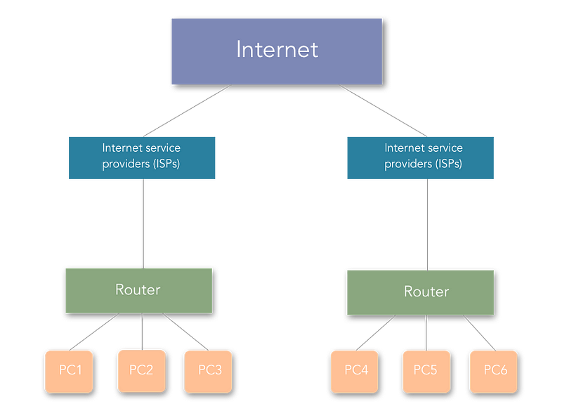
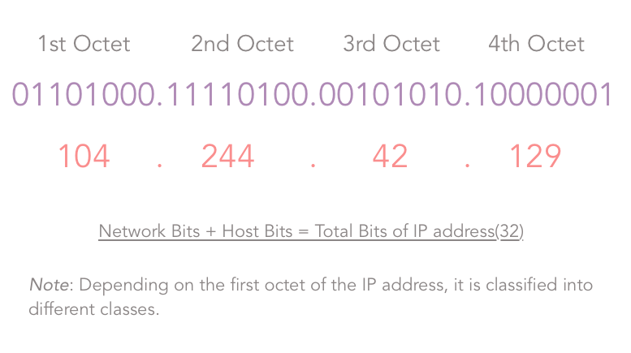
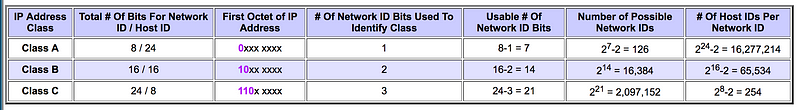
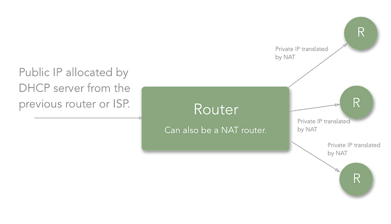
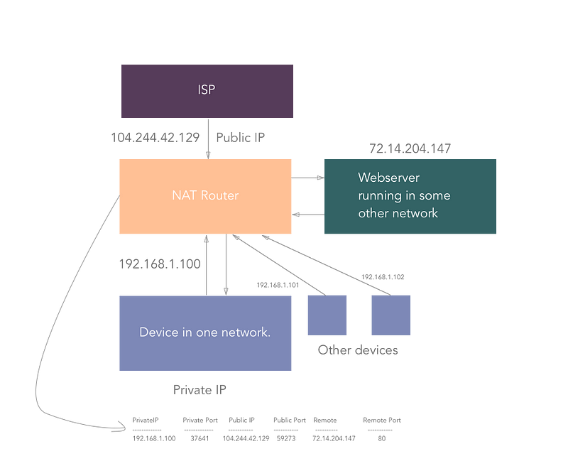
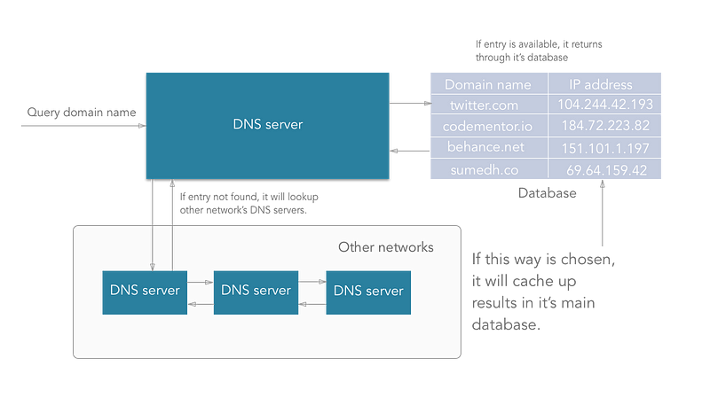
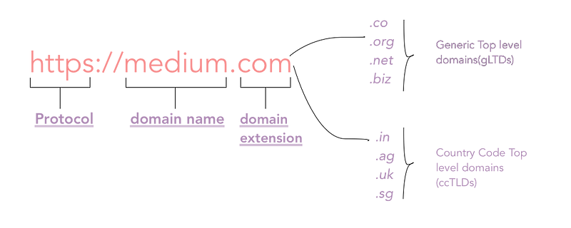
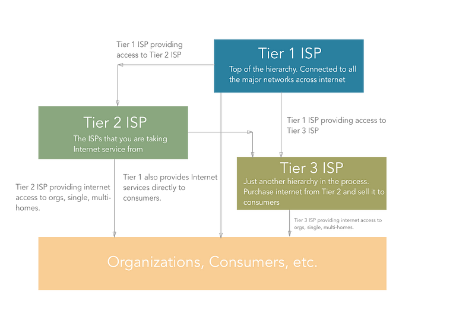
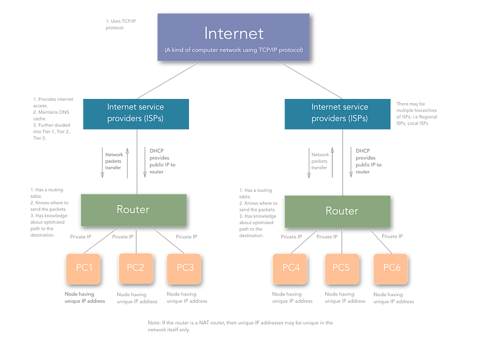

[[Index]] 

[[Basic of Networking - DevOps Training]]

[[Internet protocol - DevOps Training]] 

[[Basic of Networking - DevOps Training]]

[[OSI Model - DevOps Training]]

[[Network address and Host address - DevOps Training]] 

[[Subnetting Type - DevOps Training]]

[[Network Architecture - DevOps Training]] 

[[Networking Layers OSI Model - DevOps Training]] 

[[Internet protocol - DevOps Training]] 

[[CIDR and subnetting - DevOps Training]] 

[[AWS VPC - DevOps Training]] 

[[AWS VPC Subnets - DevOps Training]] 

Whether you are new to the world of development, or have been building things for a long time — or even if you’re a person who just likes computers and uses the internet daily — you’ve got to know the basics of networking and specifically Computer Networks.

If you like digging more into servers, their security, and how you connect to your servers from a remote client, all of this requires some knowledge of computer networks and their components. I have tried to cover most of the topics concerning computer networks in this article.

Also, from here, I will refer to “computer networks” simply as “networks”.

Let us first look at my working definition of computer networks:

> _Computer networks can be defined as the exchange of network packets between computing machines across the world with the help of data lines like wire cables, optical fibers, etc._

The **Internet** is a kind of computer network. Sorta.

We will take a look at some commonly used terms and components and how they function in a computer network, some of which are in the above diagram.

#### 

Commonly used terms in Computer Networks

Nodes in computer networks mean any computing device such as computers, mobile phones, tablets, etc which try to send and receive network packets across the network to another similar device.

Network packets are nothing but the information or units of data that a source node wants to send/receive to/from the destination node. In this article, network packets/data packets all convey the same meaning.

Consider you want to send a birthday gift to your friend on their birthday, where will you send it? To their street address right?

Same is the case here. The early computer scientists wanted to identify computers on the internet with a unique number, something like a telephone numbers today. So, they came up with the concept of TCP/IP.

An IP of a computer device is the address of that device in a computer network. Technically, it is a 32-bit number used which identifies devices in a network. All the communication to and fro from the device in that network will be done in terms of its IP address.

Consider that you are uploading a file to any site or say to Google drive.

Talking at the lowest level of network communication, your file is converted to packets and each packet has the destination node address with it which is nothing but the IP address.

On a higher level, IP addresses are classified into two types:

-   **IPv4**: IPv4 addresses are 32 bits (four bytes) as explained in the definition. An example of the IPv4 address would be **104.244.42.129** which is the IPv4 address of **twitter.com**. They are stable to use and hence are used today to identify machines in the world.
    

-   **IPv6**: IPv6 addresses are pretty new to the world and are basically eight hexadecimal numbers separated by “:”. An example of IPv6 address would be **2001:0cb8:85a3:0000:0000:8a2e:0370:7334**. They are unstable and hence not used widely yet. The web is still using IPv4 due to its stability and there is no estimate when we will start to use IPv6 since it is not stable for now.
    

IPv4 is classified into five classes named Class A, B, C, D, E.Octets in IP address.Source: tcpipguide.com

**Class A**: As shown in the third column of the above image, for a Class A IP addresses, the first bit of the first octet of the IP address is constant and is “0”.

The Second column indicates the Network bits and the host bits of the corresponding class of IP address. Consider in case of a Class A IP address, we have the following formula:

**Number of networks/subnets =** `**2^(# of network bits)**` **.**

**Number of valid hosts in each subnet =** `**2^(# of host bits) — 2**` **.**

The number of network bits and host bits are decided by the default subnet mask of the class of IP address.

The default subnet mask for a class A IP addresses is **255.0.0.0,** that is **`11111111.00000000.0000000.00000000`****\`.** Thus, for class A:

**Network bits = 8, and Host bits = 24.**

_Since Network bits = 8_, _Host bits = 24_, their sum has to be 32, since IPv4 addresses are of 32 bits. But, since we are using the one bit (first bit in the first octet) to identify the class:

_**Number of usable network bits**_ **= Number of network bits — Number of constant bits = 8–1 = 7**

_Thus, the_ **_Number of possible networks in Class A_** **=** `**2^7 — 2 = 126**` and,

_**Number of possible hosts (that is devices that can be connected to the network) per network in Class A**_ **=** `**2^24-2 = 16277214**` **.**

Now, here, for class A, you may wonder why I subtracted an extra 2 from the number of possible networks. It is because, for class A, 127.x.y.z was kept reserved. For other classes, the usual formula is used.

Thus, IP addresses in class A range from `1.x.x.x` to `126.x.x.x`.

**Class B:** the case is similar with Class B. The only difference is 2 bits of the first octet are constant (10) and they identify the class of IP address that is class B. All other calculations are same, and I am not mentioning them here since they are easy to grab from the table above. They range from `128.0.x.x` to `191.255.x.x` .

**Class C**: 3 bits of the first octet are constant (110) and they identify the class as class C. They range from `192.0.0.x` to `223.255.255.x` .

**Class D and Class E**: Class D and Class E are used for experimental purposes.

IPv4 addresses are mainly of two types:

-   **Static**: These IP addresses are the ones which remain constant for a device over time. Examples of these are the remote servers that we use to host our apps, websites, etc. where we use the ssh client to ssh to our server.
    

-   **Dynamic**: Generally, these are the IP addresses that a common computer in an Internet network is assigned. Try switching your router off and you will see a change in the IP address of your computer! (But only after reading this article 😛). Now, you may be thinking who allocates these IP addresses? It is the DHCP (Dynamic Host Configuration Protocol) server which is explained briefly further in this article.
    

**Note**: A device can have multiple IP addresses at the same time. Consider a device connected to two networks, wifi as well as any LAN network — it will have two IP addresses. This implies that the IP addresses are assigned to the interfaces and not directly to the computer.

Okay, so far so good. Let’s continue.

As its name suggests, a Router is a hardware component that takes care of routing packets. It determines which node the packet came from and which destination node the sender node want to send it to. No computer knows where other computers are located, and packets are not sent to every computer. A Router identifies the destination node address to which a network packet has to be sent and it forwards it to the desired address.

Routers have a specific **“Routing Protocol”** which defines the format in which they exchange data with another router or networking nodes. In other words, routing protocol defines how routers communicate with each other.

Routers build up a **“Routing Table”** which identifies the most optimized paths to be taken in the network while sending packets.A Router.

Technically, a routing table is just a table with the list of “routes” from one router to other. Each route consists of the address of the other routers/nodes in the network and how to reach them.

Above is an example of a routing table. The key points to take a note of here are:

-   **Destination:** This is the IP address of the destination node. It indicates where the network data packet should end up.
    

-   **Gateway:** Gateway is the component which connects two networks. Consider that you have a router connected to another router. Each of the routers has devices connected to it. So, the address of the last router (say R1 here) after which the network packet enters the other network (say R2’s network) is called the gateway. Usually, the gateways are nothing but the routers. Let me give one more example: say that your room is one network and your sibling’s room next to yours is another network, then the “door” between the two rooms can be considered the gateway. People sometimes refer to the “**routers**” as the gateway, because, that’s what they are, “**a gateway to another network**”.
    

-   **Genmask/Subnet mask:** It is nothing but the net/subnet mask. A subnet mask is a number which when combined with an IP address allows you to divide the IP space into smaller and smaller chunks for use in both physical and logical networks. The explanation of how subnet mask calculations happen is beyond the scope of this article.
    

-   **Flags:** Different flags have a different meaning. For example, in the first route, “U” in “UG” means the route is UP, whereas “G” in “UG” means GATEWAY. Since the route signifies a GATEWAY, it is a door to the other network. Whenever we send any data through this route, it gets sent to another network.
    

-   **Iface (Network interface):** Network interface refers to the network that the route defined in the routing table is having the destination computer in. That is if you are connected to Wifi, then it would be “wlan” and when you are connected to a LAN, then it would be “eth”.
    

So this is the way a router works, with the help of **Routing Protocol** and **Routing Table**.

All good up to now. But, you must be thinking —

“Okay! But hey, we are learning about components here. I need to stitch them together and get to know how the internet works.”

Cool! Some more terms and you will have a proper understanding of how everything goes.

#### 

Network Address Translation (NAT)

Network address translation is a technique used by routers to provide internet service to more devices with less usage of public IPs. Thus, a router is assigned a single IP address by the ISP and it assigns the private IPs to all the devices connected to it. NAT helps the ISPs provide internet access to more consumers.

Thus, if you are connected to the router of your house, your public IP will be visible to the world, but the private one will not. Whatever network packets are communicated will be addressed by your public IP (that is the public IP assigned to the router).Network address translation (NAT)

Consider the above figure. Let’s say that in your home network, you are trying to access **medium.com (remote static IP:** `72.14.204.147`**)**, from your computer (private IP: `192.168.1.100`).

So, for your computer, the connection looks like:

`192.168.1.100:37641` → `72.14.204.147:80` .

“37641” is the random port number assigned by NAT router to your device/computer. (When there is network communication between daemons running on different ports on a computer, the respective port is used by NAT). Each outbound connection gets an assigned port by the NAT router.

The connection is established in NAT like:

Private IP |PrivatePort |PublicIP |PublicPort |Remote |RemotePort

\------------- ------------ --------- ----------- ------- -----------

192.168.1.100 | 37641 | 104.244.42.129 | 59273 | 72.14.204.147 | 80

But, since the outside world of the network doesn’t know about your private address, the connection looks like the following to **medium.com**:

`104.244.42.129:59273` → `72.14.204.147:80` .

That way, we achieve assigning a higher number of IP addresses without wasting many public IPs.

Now, when medium.com sends the response back to `104.244.42.129:59273` , it travels all the way to your home router which then looks up for the respective private IP and private port and redirects the packet to your device/computer.

**Note**: NAT is a generalized concept. NAT can be achieved as 1:1, 1:N where 1, N are the number of IP addresses in the network. A technique called as “IP Masquerading” is a 1:N NAT.

#### 

Dynamic Host Configuration Protocol (DHCP)

**Dynamic Host Configuration Protocol** or **DHCP** is responsible for assigning dynamic IP addresses to the hosts. The DHCP server is maintained by the ISP or previous router if there is a chain of routers to reach the host.

Thus, allocation of IP addresses is carried out by the DHCP server. Generally, ISP maintains a DHCP server and the routers in our houses get assigned a public IP from the DHCP server.

**Note**: Whenever a router or say a DHCP server maintained by an ISP or router restarts, the IP address allocation starts again and devices are allocated IPs which are different than the previous ones.

#### 

Domain Name System/Server

We have already discussed that any machine is identified by the IP address.

Okay, so you are running a web server on your `localhost` on your machine. If you have dug around in the hosts on any Linux machine, you would have encountered something like this:

127.0.0.1 localhost255.255.255.255 broadcasthost::1 localhost

which means that even if you type `127.0.0.1` in your browser’s URL bar, it would mean the same as `localhost` .

Similar to the above, the websites you use daily are web servers running on some remote instance/node having a static IP address. So, typing that IP address in your browser’s URL bar will take you to the website?

Yes, surely it will. But, are you a superhuman to remember the IP addresses of thousands of sites?

Thus, there come the domains that we use, say medium.com, twitter.com, behance.net, codementor.io, etc.

> _A Domain Name Server is a server having huge records of domain name mapping IP addresses which searches for the domain input and returns the respective IP address of the machine on which the website you want to access is hosted._

**How does DNS work actually?**

-   1.
    
    DNS is managed by your ISP (internet service provider).
    

-   2.
    
    When we type an URL in the address bar, the data packets travel through your router, maybe multiple routers to your ISP where your DNS server is present.
    

-   3.
    
    DNS server present at the ISP looks up for the domain in its database. If an entry is found, then it returns it.
    

-   4.
    
    If any entry is not found in its primary database that it maintains, the DNS server will travel through the internet to another DNS server maintained by another ISP and check if the entry is available in that another DNS server’s database. Along with returning the IP address taken from another DNS, it will update the primary database with this new entry also.
    

-   5.
    
    Thus, sometimes (very rarely) a DNS server may have to traverse to multiple DNS servers to get a matching entry.
    

-   6.
    
    If after traversing a lot of DNS servers across the internet, it doesn’t get a matching entry, then the DNS server throws an error indicating that the “domain name is invalid or doesn’t exist”.
    

**The Internet Corporation for Assigned Names and Numbers (ICANN)** is a consortium (a non-profit corporation) that manages the assignment of domain names and IP address ranges on behalf of the community.

A domain is divided into three parts as shown in the following figure.

-   1.
    
    **Protocol**: The protocol used to access the website, for example, HTTP, HTTPS, etc.
    

-   2.
    
    **Domain name**: The main domain name in our domain. This can be anything that is available as per the ICANN registry.
    

-   3.
    
    **Domain extension**: This is one which is considered important while buying a domain. Generally, it is classified into two types:
    

-   **Generic Top-level Domains (gTLDs)**: This includes most popular domain extensions like .com, .org, .net, .edu, .co, etc.
    

-   **Country Code Top-level Domains(ccTLDs)**: These indicate that the domain is related to the country code specified in the domain extension. For example, “.in” indicates that the website is originated from India. Also, some of the ccTLDs require that the person purchasing the domain should be from the same country. Most of the small country code extensions are not searchable from outside that country.
    

#### 

Internet Service Providers (ISPs)

**Internet Service Providers** are the companies that provide everyone Internet. The article you are reading now is because of the internet that your ISP provides you.

ISPs provide internet, handle routing your requests to the correct destination, resolve domain names with the help of DNS cache that they maintain, and handle all this network infrastructure which enables us to use the internet.Internet Service Providers (ISP)

ISP is a hierarchical thing working across the internet. There are certain types of ISPs namely Tier 1, Tier 2, Tier 3 ISPs.

-   **Tier 1** ISPs are the ones which connect major networks on the internet. Consider them as the major highways of the internet. They are connected to almost every network on the internet. Also, they provide internet access to the Tier 2 ISPs. ex. CERFNet, UUNet, PSINet. They are also called Network Service Providers. These ISPs are connected to each other by means of [large cables](https://www.google.co.in/search?q=ISP+cables+in+sea&source=lnms&tbm=isch&sa=X&ved=0ahUKEwjO6aPV57XdAhUMyrwKHaZvAJAQ_AUICigB&biw=1920&bih=1006#imgrc=gzXVOSE_UDEmAM:) going beneath the sea.
    

-   The **Tier 2 (Regional)** ISPs are the ones who primarily provide Internet services to organizations, consumers (that is “us”) or the Tier 3 ISPs. The internet connection you are using is from a Tier 2 ISP. However, organizations can also get Internet access from Tier 1 ISPs.
    

-   **Tier 3 (Local)** ISPs are just like Tier 2. It’s just one more level of hierarchy out there that purchases bandwidth from Tier 2 ISP and sells it to consumers.
    

The traffic that goes through your router also goes through Tier 3 (if present), Tier 2, and ultimately through Tier 1 ISPs all the way to another network.

Woot Woot! I am happy that you are still with me. We will put all the things together now.

#### 

Putting all of the above things together

Up until now, we have learned about all the components needed to make everything work. Now, we will glue them together.A Detailed diagram of a general Computer Network

Let’s summarize all the things we’ve learned:

-   When a computer/device comes online, it gets a private IP assigned by the router. The router gets a public IP from the ISP.
    

-   Other devices in the network are allocated unique private IPs.
    

-   ISPs are the ones who are present across the world and are connected to each other. They sell Internet services to the regional and local ISPs, from whom we, the consumers, purchase Internet.
    

-   Thus, when a device tries to establish a network connection with some other device on some other network, it does it with the identity of its gateway (the router). The router then maps the private IP and private port number with the public IP and random high integer public port number.
    

-   The router then sends the packets to the desired destination where some other router or gateway does the same thing as the previous router and analyses which computer/device that packet came from.
    

-   The remote computer/device responds by sending the destination as the public IP and public port of the router.
    

-   The router then again checks for the private IP and private port and forwards the network packets.
    

So, this is how the **Internet** aka **A kind of Computer Network using TCP/IP protocol works**.

[[Index]] 

[[Basic of Networking - DevOps Training]]

[[Internet protocol - DevOps Training]] 

[[Basic of Networking - DevOps Training]]

[[OSI Model - DevOps Training]]

[[Network address and Host address - DevOps Training]] 

[[Subnetting Type - DevOps Training]]

[[Network Architecture - DevOps Training]] 

[[Networking Layers OSI Model - DevOps Training]] 

[[Internet protocol - DevOps Training]] 

[[CIDR and subnetting - DevOps Training]] 

[[AWS VPC - DevOps Training]] 

[[AWS VPC Subnets - DevOps Training]]