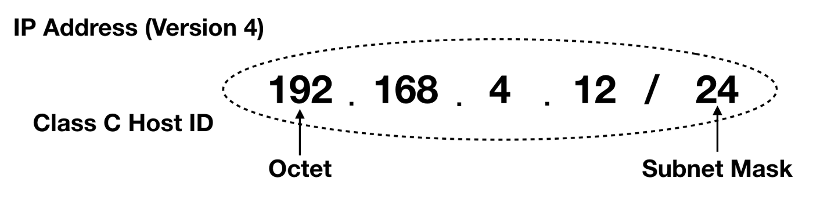
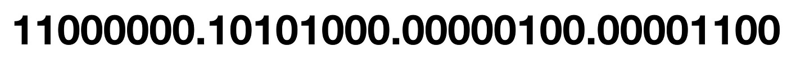
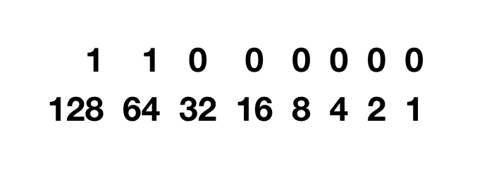
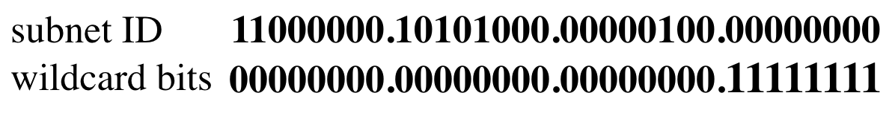
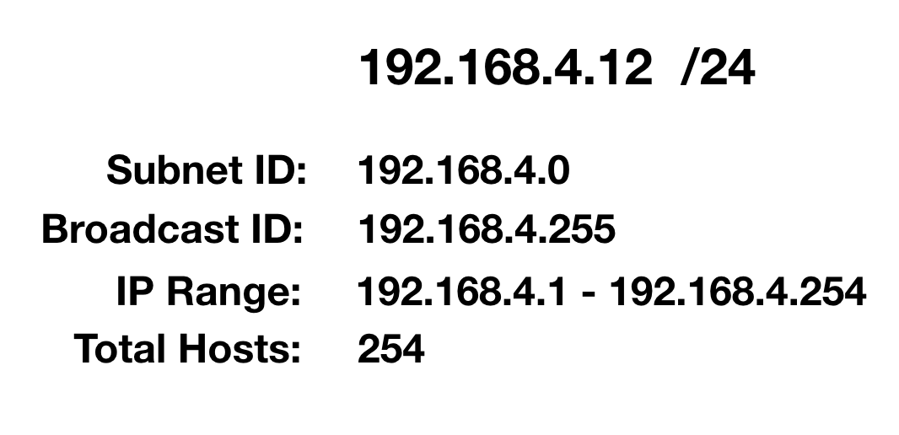

## CIDR and subnetting

[[Index]] 

[[Basic of Networking - DevOps Training]]

[[Internet protocol - DevOps Training]] 

[[Basic of Networking - DevOps Training]]

[[OSI Model - DevOps Training]]

[[Network address and Host address - DevOps Training]] 

[[Subnetting Type - DevOps Training]]

[[Network Architecture - DevOps Training]] 

[[Networking Layers OSI Model - DevOps Training]] 

[[Internet protocol - DevOps Training]] 

[[CIDR and subnetting - DevOps Training]] 

[[AWS VPC - DevOps Training]] 

[[AWS VPC Subnets - DevOps Training]] 

Another important part of IP addressing is what is called “subnetting”. Subnetting is the process of logically dividing a network into subnets. This allows network engineers to partition a network into “broadcast domains” called _segments_, so that traffic is isolated from one network segment to another.

So let’s start with an IP address: A typical Class C Host ID (IP Address)

This is a Class C IP address that cannot be used on the Internet. It is a part of the 24-bit block of private addresses which require either a proxy or address translation to route Internet traffic. In corporate business networks, assigning IP addresses using this scheme is very common. This is because assigning an actual routable IP is not practical for let’s say desktop computer inside the network. If the world used all actual public IP addresses, we would surely not have enough to go around. That is why a private IP using proxy gateways is the best way to assign an IP to any device. Public IP addresses are used for gateways, web interfaces and any front-facing device that communicates directly on the Internet.

The problem with class based IP addressing is that it limits the range of IP subnets. The class based scheme requires reserving certain octets for the network. Here is an example:

Class A reserves the first octet for the network or subnet ID. Class B reserves the 2nd and 3rd, while Class C reserves the first three octets. This is rather inefficient because addresses will run out quickly.

A scheme called **CIDR (Classless Inter-Domain Routing)** was developed to allow more networks and subnets to be created. This allows networking devices to disregard classes in IP addressing. At the same time a network can now use more bits for subnetting. That means it is no longer restricted by octets. For example, you can now borrow more bits to create more subnets, but less hosts per subnet. Overall, you can connect more hosts when you have more subnets.

An IP address is divided into 4 parts, called octets. Each octet consists of 8-bits or 1 byte of information. CIDR notation is used to identify a host portion of the IP (the address) followed by a “/” (forward slash) which refers to the subnet mask. The subnet is the partition of the network to which the host belongs to, and the subnet mask is what identifies it. If you add up all the octets in an IP address you get:

**8 + 8 + 8 + 8 = 8-bits x 4 octets = 32 bits**

The CPU embedded in computers and digital electronics in hosts and devices do not read numbers like we do. We know our numbers based on the decimal system. In digital electronics it requires converting from decimal to machine readable binary numbers. So our IP address example above must be converted to binary.

192.168.4.12 converted to binary numbers

Digital electronics uses strings of 1’s and 0’s that make up binary numbers. Digital electronics like computer devices, use circuits called transistors to process information as a presence of voltage that is either on (1) or off (0). Each position in a binary string has a corresponding number that can either be expressed in hexa-decimal (base16) or decimal (base10).

Base2 numbers are binary, while the numbers we are familiar with are base10. We call our decimal number system base10 because we have a finite set of “base” numbers from 0 to 9:

All other numbers used in the decimal system are a combination of any of those base numbers.

Base2 on the other hand only has 2 “base” numbers:

All other numbers in the binary system are a combination of 1 and 0 base numbers.

To simplify things I will use base2 to give a clearer understanding, though machines prefer base16 which is actually faster to compute. Now to understand why 11000000 is the binary equivalent of 192, let’s look at the IP address in base2.

The 1’s position indicates the base2 numbers that make up 192

What we need to look for is which position in the binary string has a value of 1. We can clearly see that when we add 128 + 64 we get 192. Likewise for the other octets we do the same procedure.

Going back to our IP address, 192.168.4.12, we need to identify its subnet, broadcast address and range of IP addresses used. Here is a brief explanation of those variables we are looking for.

#### 

_subnet_ — Logical division or segment of an IP network.

**_broadcast address_** — The address in a subnet not assigned to single host, it is broadcasted or sent to all hosts and devices on the network.

_r_**_ange of IP address_** — This is the number of IP addresses that can be used on the network.

To find the subnet, you must first identify the subnet mask. From our CIDR notation example you have a /24 subnet mask which translates to binary as:

**11111111.11111111.11111111.00000000**

In a Class C IP address, the first 3 octets are reserved for the network. In decimal, this is converted to:

Now we take our IP address 192.168.4.12 and perform a logical **AND** operation with the subnet mask and we get this result:

**11111111.11111111.11111111.00000000 11000000.10101000.00000100.00001100**

**11000000.10101000.00000100.00000000**

The subnet is therefore **192.168.4.0**.

Since we know the network portion of the ID based on the subnet, we now take what is called the _wildcard bits_ which will indicate the portion of the octet bits that are not a part of the network. We logically assign a value of 1 to all those bits, and in this example our wildcard is:

Now using our example, since the subnet is 192.168.4.0, the last octet consists of the wildcard bits. Since all bits are set a value of 1, it will be:

That is then our broadcast address. Think of the broadcast ID as an inversion or opposite of the bits set in the subnet ID.Wildcard bits are the portion of the IP address that is not part of the subnet which are set a value of 1.

### 

Finding the IP Address Range

By now we can already see from this example, that we have a determined range already. We know the subnet ID is 192.168.4.0. That means that the first usable logical IP address that can be assigned on the network is 192.168.4.0 plus one. So our first IP starts from:

**Now that we know the first IP address in the network, we can determine the last based on the broadcast ID. In this case we need to subtract 1 from the broadcast ID and we get:**

**Therefore, the last usable IP address is 1 less that of the broadcast ID. We then have a total of 254 hosts on the network from 192.168.4.1–192.168.4.254.**

Another way to look at this is that we have 256 IP addresses on the network from 0 to 255. You take the total IP addresses of 256 and subtract 2 from it. We subtract by 2 in order to exclude the IP address assigned to the subnet and the broadcast ID.

Finding the total hosts on the network

Thus we have a total of 254 hosts (256–2) on the network.

Based on the information we have gathered about 192.168.4.12/24, we can construct a table.

In the real world, there are more complex networks that don’t use a /24 subnet mask. If we were to change the /24 to /20 it will be a totally different result. We can create more subnets and add more hosts.

Suppose an ISP has provided following network range 192.39.101.X/24 to an organization. Now the organization wants to divide this into 8 sub networks (subnets). Starting three bits of last byte (denoted by X) will be used to divide the whole network into 8 parts. ‘/24’ notation is used to denote the network bits, and other are non network bits. In this case first 24 bits or first 3 bytes are network bits and remaining 8 bits can be used by the organization to assign IP addresses to nodes within the organization.

Now 8 subnets will have the following IP addresses (First three will remain same for all 192.39.101. I have only shown the last byte, X part). 8 bits denotes subnet ID:

-   1.
    
    00000000 (IP address range will be 192.39.101.0/27 to 192.39.101.31/27)
    

-   2.
    
    00100000 (IP address range will be 192.39.101.32/27 to 192.39.101.63/27)
    

-   3.
    
    01000000 (IP address range will be 192.39.101.64/27 to 192.39.101.95/27)
    

-   4.
    
    01100000 (IP address range will be 192.39.101.96/27 to 192.39.101.127/27)
    

-   5.
    
    10000000 (IP address range will be 192.39.101.128/27 to 192.39.101.159/27)
    

-   6.
    
    10100000 (IP address range will be 192.39.101.160/27 to 192.39.101.191/27)
    

-   7.
    
    11000000 (IP address range will be 192.39.101.192/27 to 192.39.101.223/27)
    

-   8.
    
    11100000 (IP address range will be 192.39.101.224/27 to 192.39.101.255/27)
    

The above list provides the IP address range for all 8 subnets within the organization. This range is generated by making the last 5 bits from 00000 to 11111. In the above case every subnet has 32 addresses. Thus 30 hosts (computers) can be attached to the given subnets. This is because first IP address is the subnet address (or network ID) and the last address is the broadcast address.

The first address of each subnet (**subnet ID**) is the netmask of the subnet. This is used by the router to determine whether the incoming packet belongs to the corresponding subnet or not. Router does this by ANDing the destination IP address of the incoming packet with the netmask of the subnet. If the result is the subnet ID (or the netmask itself) then the packet belongs to the subnet, else the router forwards the packet to another router. This is how routers perform forwarding and routing of packets. This how subnet IDs are used.

The **broadcast address** is used by the nodes, whenever they want a packet to be delivered to all the nodes in a given subnet. This is used by ARP packets. Consider that a node ‘A’ wants to send the packet to node ‘B’ within its subnet. The link layer headers require MAC addresses of nodes who wants to communicate. Since the destination MAC address is not known to the source, an ARP broadcast (all nodes in the subnet receive this packet) is send asking for MAC address of the node with given IP address. In a safe environment, the node with the given IP will provide a unicast ARP reply to source telling its MAC address. Now the source can use this info to construct link layer header fields in the original packet.

[[Index]] 

[[Basic of Networking - DevOps Training]]

[[Internet protocol - DevOps Training]] 

[[Basic of Networking - DevOps Training]]

[[OSI Model - DevOps Training]]

[[Network address and Host address - DevOps Training]] 

[[Subnetting Type - DevOps Training]]

[[Network Architecture - DevOps Training]] 

[[Networking Layers OSI Model - DevOps Training]] 

[[Internet protocol - DevOps Training]] 

[[CIDR and subnetting - DevOps Training]] 

[[AWS VPC - DevOps Training]] 

[[AWS VPC Subnets - DevOps Training]]