[[Index]] 

[[Basic of Networking - DevOps Training]]

[[Internet protocol - DevOps Training]] 

[[Basic of Networking - DevOps Training]]

[[OSI Model - DevOps Training]]

[[Network address and Host address - DevOps Training]] 

[[Subnetting Type - DevOps Training]]

[[Network Architecture - DevOps Training]] 

[[Networking Layers OSI Model - DevOps Training]] 

[[Internet protocol - DevOps Training]] 

[[CIDR and subnetting - DevOps Training]] 

[[AWS VPC - DevOps Training]] 

[[AWS VPC Subnets - DevOps Training]]

When I first started coding, I spent a lot of time using [CodePens](http://codepen.io/).

I wrote HTML; I saw things appear.


My understanding was of the form:

> Write this code; website will look like this. Write that code; website will look like that.

I never really understood “how to make the code into a website”, though.

I didn’t understand how the web works.

## **Requests**

The web is sorta like a restaurant: when you want something, you have to ask for it. For example, at a restaurant, you may ask the server for a cheeseburger:

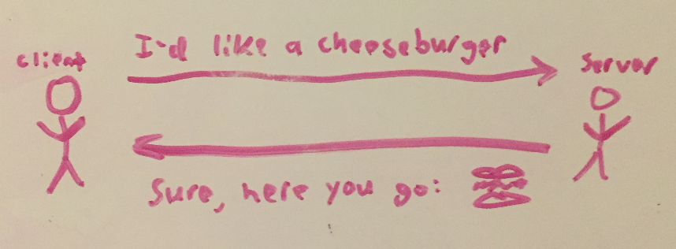

Similarly, on the web, when you want to see cnn.com, you have to ask for it. You have to make a request:

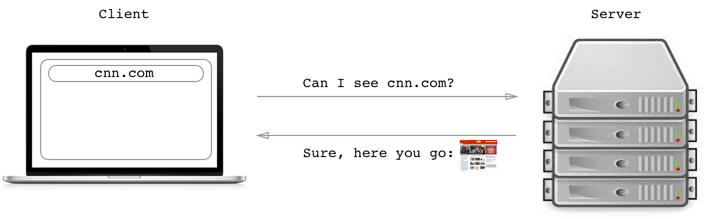

I don’t think this is obvious! When you use the web, you type cnn.com, and it just pops up. You don’t see anything _leave_ your computer. You don’t see your computer _receive_ anything. It looks like your computer is acting alone.

## Delivery service

You can go to the Postal Service and say:

> Here’s an envelope. Please deliver it to John Doe.

Similarly, you can go to The Internet and say:

> Here’s a packet (of digital information). Please deliver it to cnn.com.

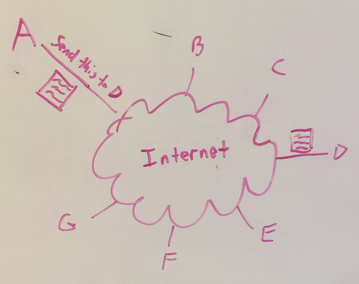

Like the Postal Service, the job of The Internet is to deliver messages. It doesn’t care what’s “in the envelope”. It doesn’t care what language it’s written in (HTTP, SMTP, FTP, etc.). It’s job is just to deliver it.

## Protocols

Before studying networking, I had the impression that things like HTTP, SMTP, FTP, and DNS are “things that networking people talk about”.

These things are all basically just languages. Like English, Spanish, Chinese, and German.

The Internet doesn’t “look inside the envelope”. It doesn’t care what’s written in the envelope, much less what language it’s written in. Studying The Internet (and other networks) is about studying how to deliver messages from point A to point B, not about what’s inside the envelope.

Nevertheless, these protocols are associated with networking. Probably because they are the “raw” messages that are being sent and received. Application developers, like web developers, often don’t deal with these messages in their raw form. For example, if I want to make an API request, I would write the following code:

```
$.ajax(  ‘api.com/users’,  { method: ‘GET’ },  function (users) { … });
```

Little do I know, the request that is actually sent out looks like this:

```
GET /users HTTP/1.1host: api.com...
```

Furthermore, under the hood, my jQuery gets passed along to other code that does the job of actually sending the request out. Code that “networking people” write. That code looks something like this:

```
var net = require('net');var client = new net.Socket();client.connect({  host: 'api.com',   port: 80,});client.write(  'GET /users HTTP/1.1' +  'host: api.com');client.on('data', function (users) { ... });
```

## Web browsers

I like to think of web browsers as translators. In the real world, a translator could help an english speaker like me communicate with someone who only speaks French. In the digital world, I see the web browser as a translator for two different types of people:

1.  Normal users
2.  Web developers

## Normal users

In the first diagram I drew, I wrote `Can I see cnn.com?` as the message that is sent to the server:

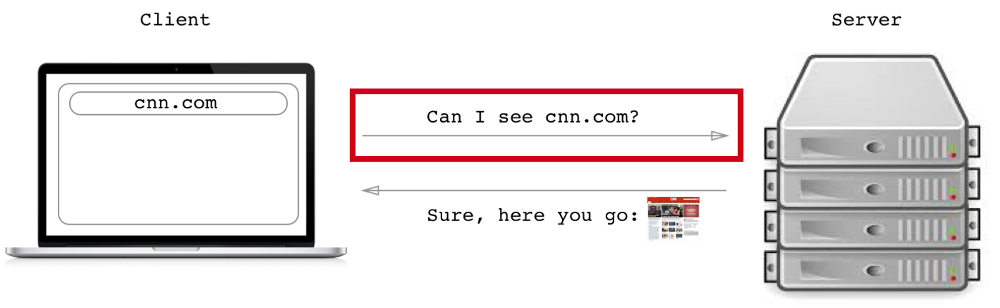

Similarly, I wrote `Sure, here you go [web page]` as the message that is sent back to the client:

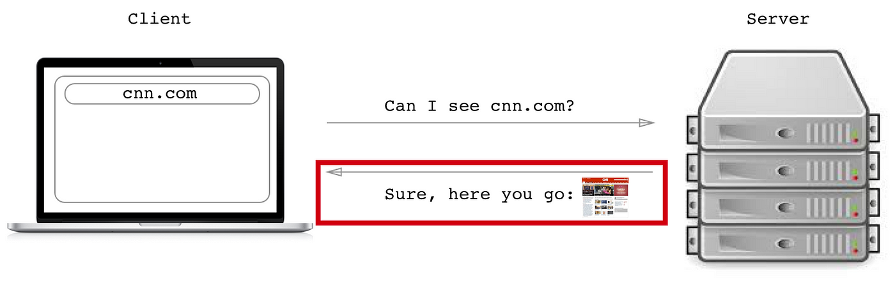

As you may have guessed, this isn’t how it actually works.

The server doesn’t speak english, it only speaks HTTP. You, as a normal user of the internet, don’t speak HTTP, so you need a translator. The web browser acts as your translator.

It translates your english requests into HTTP for the server to understand:

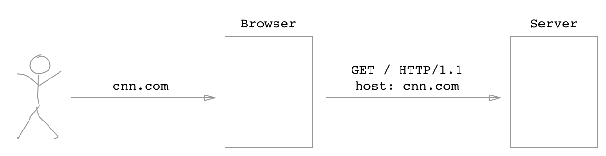

And it translates the HTTP response from the server into a nice web page for you to understand:

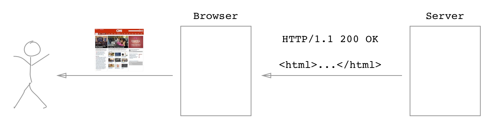

So, all in all, this is what the browser is doing for you:

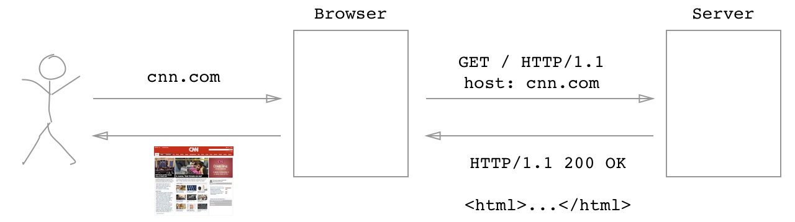

And here’s a video demonstrating this happening:

## Web Developers

As a web developer, you probably don’t speak Raw HTTP. But you probably do speak Ajax. Since servers don’t speak Ajax, you need the web browser to act as your translator:

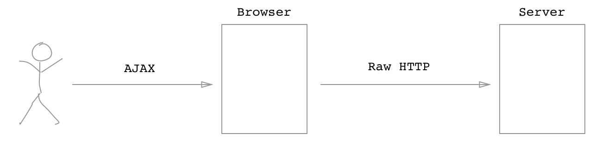

Similarly, you need the browser to translate the Raw HTTP response into something you can use. Like a JavaScript array containing a list of users:

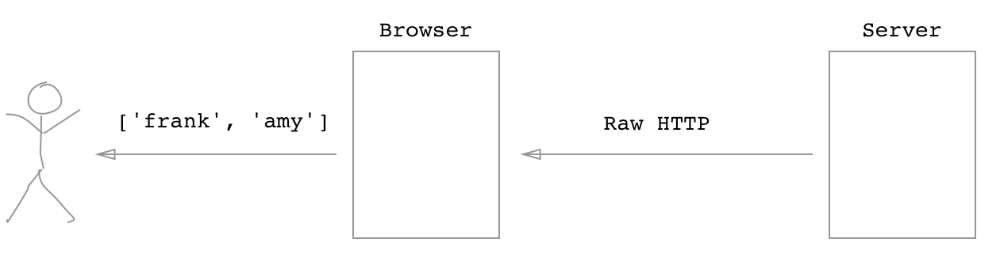

Overall:

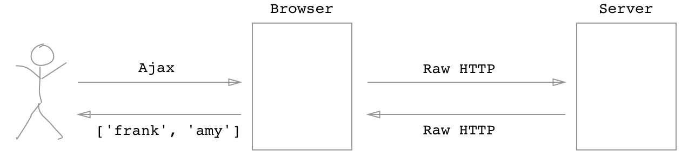

## Other translators

Web browsers aren’t the only translators out there. Let’s talk about two other translators:

1.  Web server frameworks
2.  Mail clients

## Web server frameworks

They take raw HTTP and translate it into something the programmer has an easier time dealing with:

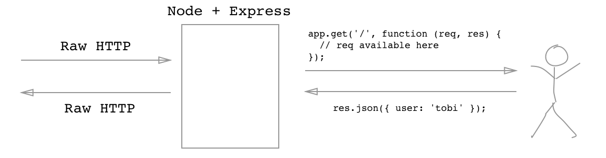

## Mail clients

This is how email works:

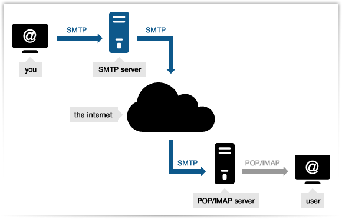

1.  You speak SMTP to your mail server.
2.  That mail server sees that your message is to `john.doe@gmail.com`, and then delivers the message to John Doe’s mail server, speaking the language of SMTP, and using The Internet as the delivery service.
3.  Finally, John Doe asks his mail server if he has any new emails, and the server responds, in the language of POP or IMAP, with the email you sent to him.

SMTP actually isn’t too difficult a language. It looks something like this:

```
Client: HELO adamzerner.comServer: 250 Hello adamzerner.comC: MAIL FROM: <adam@adamzerner.com>S: 250 adam@adamzerner.com … Sender okC: RCPT TO: <john.doe@gmail.com>S: 250 john.doe@gmail.com … Recipient okC: DATAS: 354 Enter mail, end with “.” on a line by itselfC: Hello John,C: How are you?C: From, AdamC: .S: 250 Message accepted for deliveryC: QUITS: 221 smtp.gmail.com closing connection
```

Of course, _you_ aren’t actually speaking SMTP, or reading POP/IMAP. _You_ don’t speak those languages. But your mail client does! So your mail client acts as your translator. It translates the emails you write into SMTP:

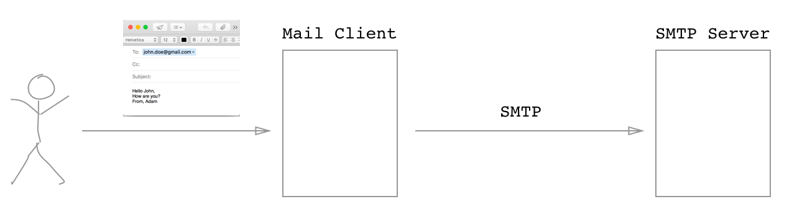

And it translates POP or IMAP into the emails that you read:

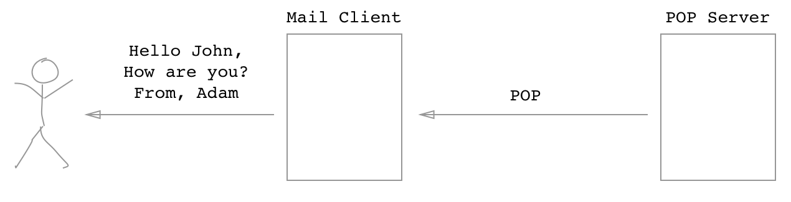

## Publishing

Before moving on to the actual delivery service that The Internet provides, let’s talk about how you’d go about publishing a website.

Suppose you have a website you’ve been working on locally, and are ready to publish it to the internet so that others can see it. How would you go about doing that?

Let’s ask an analogous question: suppose you have been baking cookies and want to open a restaurant to sell them to others. How would you go about doing that?

Well, the way I see it, you need four things:

1.  To rent out a building to use as your restaurant.
2.  To move the cookies from your kitchen to this new restaurant of yours.
3.  To tell people where your restaurant is so that they could find it. (Perhaps you need to advertise too.)
4.  To train servers to take the customers order. If the customer requests a chocolate chip cookie, the server better not respond with an oatmeal raisin one!

Similarly, to publish a website, you also need four things:

1.  A physical server to host your website. Like the restaurant example, you often rent space in an existing server rather than buying and managing your own. Although, like the real world, if you’re a big serious organization, you’ll often choose to buy your own.
2.  To move the code on your local computer to your server.
3.  To tell people where your server is, so they could request files. You give people a domain name, like “www.cnn.com”, and they use this to find your website. On the internet there is no foot traffic, so you need to figure out how to get the word out. The closest thing to foot traffic is google searches, but you won’t appear high enough on those searches unless you’re already popular.
4.  To write server side code that responds to the requests of users properly. If a user requests “www.coolsite.com/apples”, you better not respond with “www.coolsite.com/oranges”!

## Indirect path

Now let’s start talking about how the delivery service that The Internet provides actually works.

So far we’ve been drawing a direct line from the client to the server, and from the server to the client. As if there’s a wire connecting them, and communication is as simple as sending data through the wire.

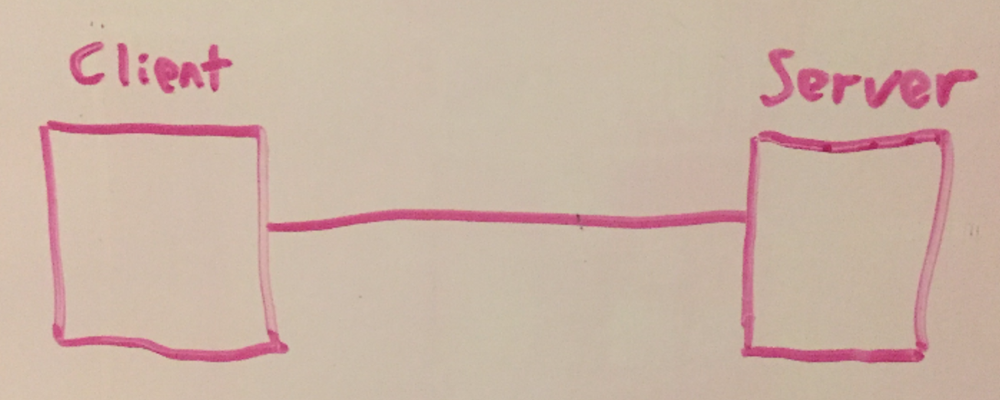

Reality looks more like this:


There isn’t a direct line between the two red nodes. The data has to hop between the intermediate white nodes, which are called routers.

As an analogy, think about our roads. Suppose you want to drive to the bank. Imagine if there was a direct road from your driveway to the banks parking lot. That would be crazy! How are you supposed to get to the grocery store? The park? The mall? Are there going to be direct roads from your driveway to their parking lots too?

Of course not. Instead, there’s a hierarchy of roads: neighborhood streets, main streets, highways, interstates, etc. The internet is designed similarly.

## Cloud

People often draw diagrams with a cloud, like this:

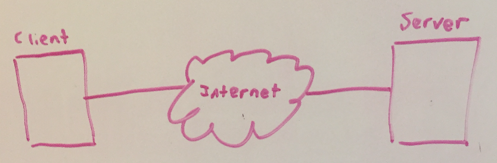

These diagrams correctly show that the data doesn’t flow directly from the client to the server — it flows through The Internet first.

But in what way does it flow through this Internet thing? How does it bounce around and eventually find it’s destination? Let’s find out.

## DNS

If you ask the Postal Service to deliver your letter to John Doe, they won’t be able to help you because they don’t know where John Doe lives. They need an address.

Similarly, if you ask The Internet to deliver your message to cnn.com, it won’t be able to help you because it doesn’t know where cnn.com lives. It needs an IP address.

The first step is to get this address.

In real life, the Postal Service won’t help you find John Doe’s address — you’re the one who has to look it up. In the digital world, The Internet is a bit more helpful than the Postal Service — it’ll look up cnn.com’s IP address for you. It uses something called DNS to do so.

At a high level, this is what’s happening:

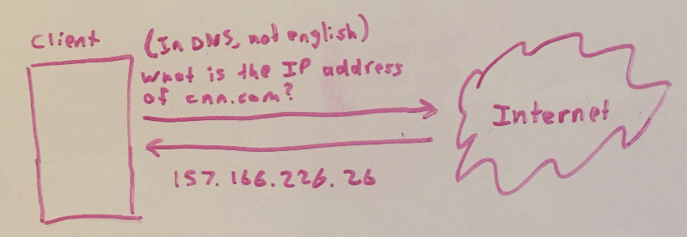

Now let’s dig in to _how_ that happens. This is the overview:

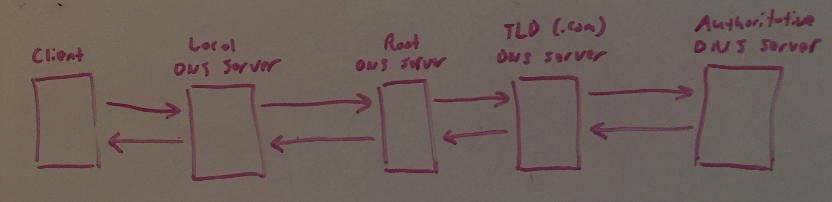

And these are the details:

```
I need to know the IP address of cnn.com. My internet service provider told me to ask their Local DNS Server these sorts of questions. They told me it's located at 123.456.789.001 - let me ask it.Client: Hey Local DNS Server - what's the IP address of cnn.com?Local DNS Server: I don't know, but let me forward this along to the nearest Root DNS server to handle.Root DNS Server: I see that you're looking for a ".com" - let me forward this along to the nearest .com TLD DNS Server.TLD DNS Server: I see you're looking for cnn.com. I know who could handle that for you - let me forward this to the right Authoritative DNS Server.Authoritative DNS Server: cnn.com? That's at 157.166.226.26.
```

Another example:

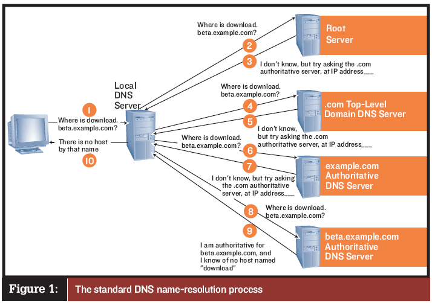

Allow me to elaborate a bit.

## **Root DNS Servers**

There aren’t too many root servers in the world. Here is a map of all of them:

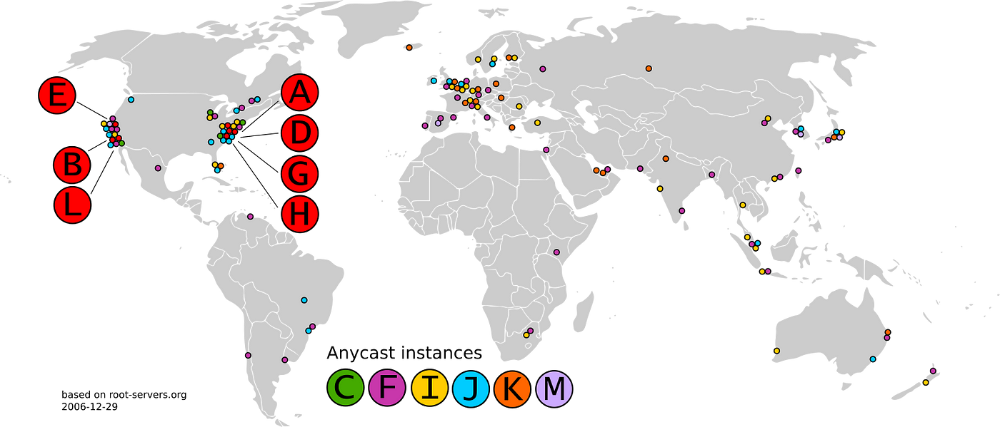

[https://en.wikipedia.org/wiki/Root\_name\_server](https://en.wikipedia.org/wiki/Root_name_server)

## **Local DNS Servers**

Since there are so few Root DNS Servers, it makes sense to have a Local DNS Server nearby to route you to the Root Server.

## **TLD DNS Servers**

.com is only one of the potential domains. As the image shows, there’s also .org, .edu, .net, .mil, .gov, .us, .uk, and many more.

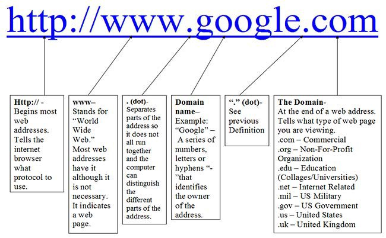

## **Authoritative DNS Servers**

Big companies like Google usually have their own Authoritative Servers. Individuals and smaller companies usually pay to rent space on an Authoritative Server of some service provider.

## Caching

Consider this stupid Local DNS Server, and an angry client:

```
Monday morning, 8:00amClient: Hey Local DNS Server - what's the IP address of cnn.com?Local DNS Server: I don't know, but let me forward this along to the nearest Root DNS server to handle it.Tuesday morning, 8:00amClient: Hey Local DNS Server - what's the IP address of cnn.com?Local DNS Server: I don't know, but let me forward this along to the nearest Root DNS server to handle it.Wednesday morning, 8:00amClient: Hey Local DNS Server - what's the IP address of cnn.com?Local DNS Server: I don't know, but let me forward this along to the nearest Root DNS server to handle it.Thursday morning, 8:00amClient: Hey Local DNS Server - what's the IP address of cnn.com?Local DNS Server: I don't know, but let me forward this along to the nearest Root DNS server to handle it.Client: You idiot! I ask you this every day, can't you just remember!
```

Indeed, in the real world, servers do have a memory for things you frequently ask it. This is called caching.

But what if the IP address of cnn.com changes? The authoritative server will receive this updated IP address, but the cached version in your local DNS server won’t. What would we do then?

It’s not an easy problem to solve:

> There are only two hard things in Computer Science: cache invalidation and naming things.
> 
> — Phil Karlton

What we do in practice is discard the cached version of an IP address after two days or so. It’s rare for IP addresses to change more frequently than that.

## Routing

Now you know that you want to send your request to _157.166.226.26._ But how do you do that!

Let me pose an analogous question: I live in Las Vegas, Nevada. If I wanted to drive to _123 Main Street, Orlando, Florida_ to deliver a message, how would I do that?

Like this:

```
drives to local gas stationMe: How do I get to 123 Main Street, Orlando, Florida?Local Gas Station: I don’t know how to get there exactly, but since it’s in Florida you’ll have to take the interstate. Once you get off, ask someone else.takes interstate to FloridaMe: How do I get to 123 Main Street, Orlando, Florida?Gas Station in Florida: I don’t know how to get there exactly, but since it’s in Orlando, you’ll have to take this highway. Once you get off, ask someone else.takes highway to OrlandoMe: How do I get to 123 Main Street, Orlando, Florida?Gas Station in Orlando: Take Wood Street all the way down and turn left onto Main Street.takes Wood Street; arrives on Main streetMe: How do I get to 123 Main Street, Orlando, Florida?Kid on Bike: You’re on Main Street in Orlando, Florida — house #123 is six houses down on the right.drives six houses down; arrives at destinationdelivers message to destination
```

Computer networks work the same way:

```
Client: How do I get to 157.166.226.26?Local Router: I don’t know, but I know it’s in this general vicinity. Router #2 is in that vicinity — take this wire to Router #2 and ask him.takes wire to Router #2Client: How do I get to 157.166.226.26?Router #2: I don’t know, but I know it’s in this general vicinity. Router #3 is in that vicinity — take this wire to Router #3 and ask him.takes wire to Router #3Client: How do I get to 157.166.226.26?Router #3: I don’t know, but I know it’s in this general vicinity. Router #4 is in that vicinity — take this wire to Router #4 and ask him.takes wire to Router #4Client: How do I get to 157.166.226.26?Router #4: Take this wire; it’ll take you directly to your destination.takes wire to 157.166.226.26delivers message to 157.166.226.26
```

You may have noticed that IP addresses have four parts, with each part being separated by a dot. This is analogous to how a physical address has four parts: city, state, street number, and house number.

In the car example, the gas station attendants routed you using a particular part of the address.

-   When you were in Vegas, the attendant realized that the end destination was in a different state, so he told you to take the interstate to Florida.
-   When you were in Florida, the attendant realized that you’re in the right state, but the wrong city, so he told you to take the highway to Orlando.
-   When you were in Orlando, the attendant realized that you’re in the right city and state, but wrong road, so he told you to take Wood Street all the way down to get to Main Street.

Internet routers work very similarly.

They use something called a forwarding table. A forwarding table is just a long list that says:

> If they’re looking for IP Address #1, tell them to take wire A. If they’re looking for IP Address #2, tell them to take wire B…

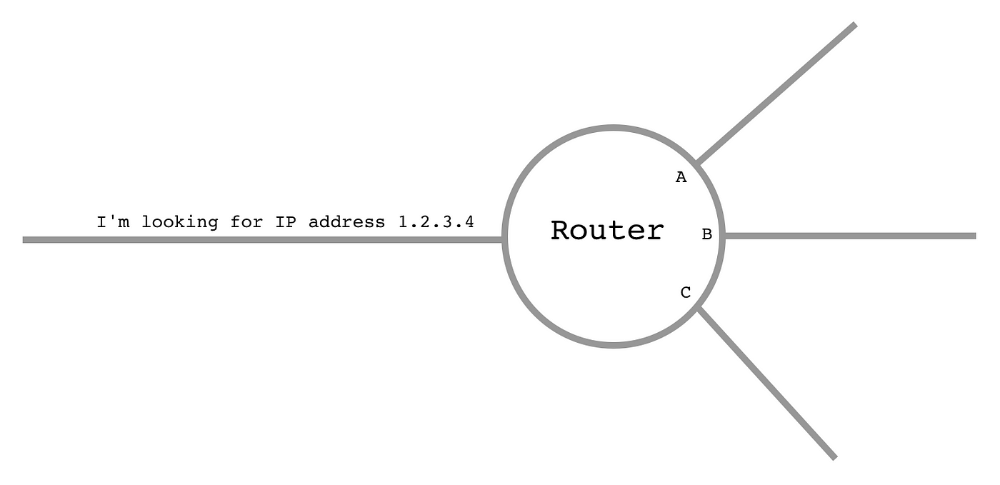

Except forwarding tables use a shortcut — instead of going one by one, they often say:

> If you’re looking for an IP address **in this range**, take wire A.

This is analogous to how the first gas station attendant reasoned:

> Since the address you’re looking for is part of the range of addresses outside of Nevada, you should take the interstate.

Using ranges is easier. “All destinations outside of Nevada should take the interstate” is easier than “Destination 1 should take the interstate; Destination 2 should take the interstate… Destination 1,000,000 should take the interstate”. It’s too tedious to list out the instructions one by one.

You can use a program called [traceroute](https://linux.die.net/man/8/traceroute) to see the path your requests take. Here is an example:

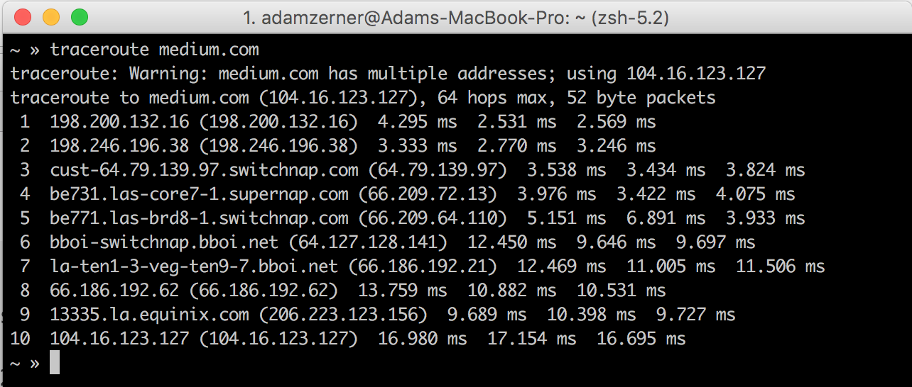

This shows that the request went from my computer, to `198.200.132.16`, to `198.246.196.38`, to `cust-64.79.139.97.switchnap.com`… and eventually to the end destination.

## **Who pays for it?**

Let’s talk about who pays for The Internet. In doing so, we’ll get a better sense of how it’s structured.

## Access network

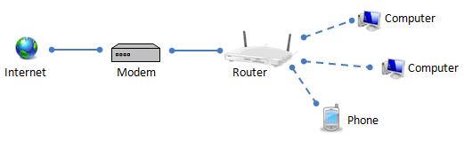

Your modem and everything to the right of it is considered to be an [access network](https://en.wikipedia.org/wiki/Access_network), because it’s the network of devices that allows you to _access_ the internet.

You may recall going to the store and paying for your router and modem. Or maybe they were free as part of your ISP package.

And of course, you’re the one who paid for your computer! Your computer is part of the network too. It’s at the “edge”, and is thus considered to be an [end system](https://en.wikipedia.org/wiki/End_system).

In the old days, people would purchase other devices to be part of their access network like hubs, switches, firewalls, and wireless access points. Nowadays, these devices are usually just combined into one device.

## Network core

You pay a regional internet service provider (ISP) for internet connection. For example, I live in Las Vegas and I pay [Cox](https://www.cox.com/residential/home.html) for my internet access. Cox has a bunch of routers in the area. So if I want to request something from a server here in Vegas, Cox’s network of routers will be able to get me there.

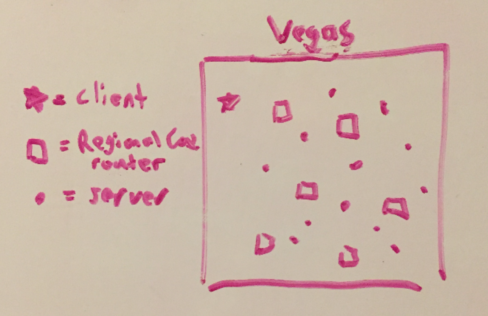

But if I want to request something from a server across the country in New York, Cox won’t be able to get me there. Cox is only a _regional_ provider, so they only have routers in the Vegas region.

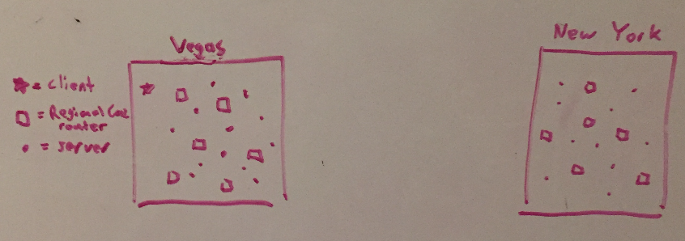

However, Cox pays a _national_ ISP so that it’s regional network can connect to the local New York regional network.

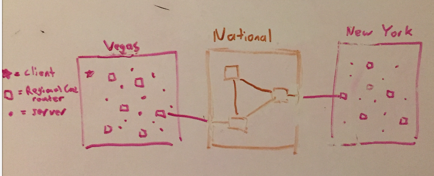

Note that in this relationship, Cox is the buyer and the national ISP is the seller. But this just leads to Cox raising their prices, so ultimately it’s you who is paying for all of this.

Actually, this is a simplification. It should suffice for a high level understanding, but if you’re curious, here are some caveats:

-   Sometimes there are various tiers of regional ISPs. For example, in a populated area like New York, maybe there’s a low level regional ISP that serves Manhattan, a different one that serves Queens and Long Island, a different one that serves upstate New York, and perhaps these three low level regional ISPs connect to a mid level New York ISP, which then connects to a national ISP.
-   Sometimes clients connect directly to the National ISP.
-   Sometimes clients connect to more than one regional ISP. Sometimes regional ISPs connect to more than one national ISP. Either way, it’s called [multihoming](https://en.wikipedia.org/wiki/Multihoming).
-   Sometimes regional ISPs connect with each other directly rather than going through a national ISP. This is called [peering](https://en.wikipedia.org/wiki/Peering).

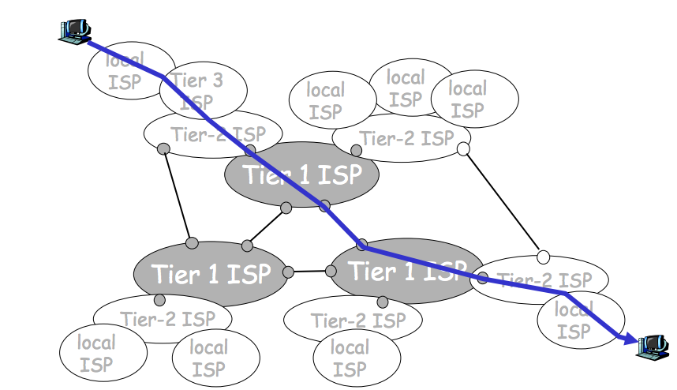

## Servers

Let’s think back to the Postal Service analogy. In delivering a letter, there are three parts:

1.  You
2.  The Postal Service
3.  The recipient

In this section, we talked about who pays for the first two parts, but we didn’t talk about the last part. So, who pays for the servers?

Well, the people who own the websites do.

Think back to the section on publishing a website. Recall the restaurant analogy. To open the restaurant, the first thing you need is a building. As the owner of the restaurant, _you_ need to buy or rent the building.

It’s the same thing with servers on the internet. You need to either:

1.  Buy a physical server, set it up, and connect it to the internet.
2.  Rent server space from someone else.

Either way, the people who pay for the servers on the internet are the ones who own the websites.

## Wires

You may have noticed that sometimes your phone provider is the organization that provides you with internet connection. Huh? What do phones have to do with internet?

I’ll show you. When the phone company provides you with internet connection, they use something called [DSL](https://en.wikipedia.org/wiki/Digital_subscriber_line). This is how DSL works:

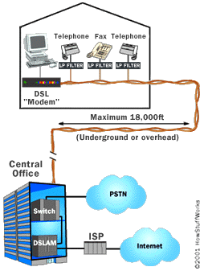

Take a look at that orange wire. Notice that it provides internet connection _and_ telephone connection. How is that possible?

Well, basically, there’s room in the wire:


We can use that empty space to provide internet connection:


This way, you can actually make phone calls and use the internet at the same time!

In reality, it’s more like this:

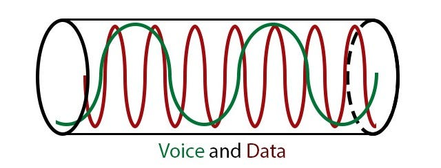

Voice and data flow through the wire at different frequencies. Then a splitter picks out the voice waves and sends them to your telephone. Finally, your internet modem picks out the internet waves and sends them (through your router) to your computer.

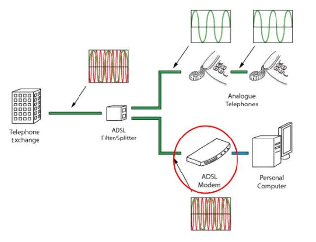

## Why not just have separate wires for phone and for internet?

Well, that would be very expensive to do. Your home is already connected to the phone company wires. To connect your home to a new set of wires, it’d involve a lot of digging and breaking down walls. And a lot more of these:

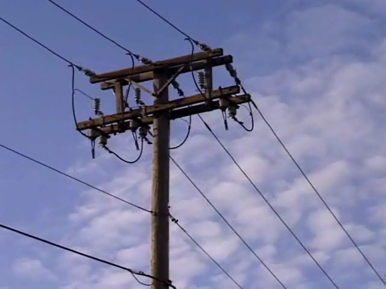

No bueno. It’s easier and cheaper to just use the wires you already have access to.

## Cable

Cable internet access works similarly:

-   Your cable company sends one wire to your house.
-   Internet waves and cable TV waves are sent through that wire at different frequencies.
-   A splitter and cable modem are used to direct the cable waves to your TV, and the internet waves to your computer.

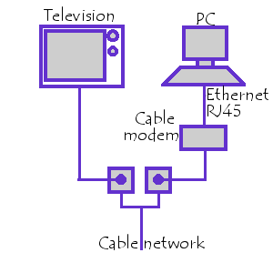

## Fiber

With Google Fiber (and Verizon FIOS, and some other services), they strive for awesomeness. They don’t just use the preexisting telephone/cable wires — they spend the money to set up new fiber optic cables and connect them directly to your home. This is expensive to do. But since fiber optics are amazing, you get really fast internet connection.

This is how Google Fiber does it:

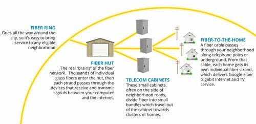

[https://fiber.googleblog.com/2013/10/behind-scenes-with-google-fiber-how-we.html](https://fiber.googleblog.com/2013/10/behind-scenes-with-google-fiber-how-we.html)

## Satellite

Some people in isolated rural areas receive internet connection from radio waves. Sometimes the satellites are on earth. And sometimes they’re in outer space!

You’re also probably aware that you can use things like 3G, 4G and LTE to receive internet connection on your phone. Basically, this uses the same infrastructure and technology that you use when you talk on your cell phone.

## Internet core

> What about the ISPs? What kind of wires do their routers use to connect to each other?

They use the good stuff — fiber optics. You need fiber optics for such long distances.

## Access network

> What about inside of your actual access network? Like, connecting your computer to your modem?

Psh, you already know — ethernet or wifi!

In case you needed a music video break

## Modems, routers, and other access network devices

At this point, perhaps you understand:

1.  The job of the modem is to pick out the internet waves.
2.  The job of a router is to broadcast the internet connection to various devices.

But perhaps you’re wondering if you really need a router. Perhaps you only have one device — why not just plug it directly into the modem? Even if you only have two or three devices, the modem usually has enough ports for you to plug the devices directly in.

You’re right — anything you plug into the modem will receive internet connection. If your modem has enough ports for all your devices, they can all receive internet connection.

However, as I briefly mentioned earlier, nowadays, the router you buy often has a bunch of other devices stuffed into it: a switch, firewall, NAT, etc. These are all things you’ll want, and for that reason, [you’ll want to have a router as well as a modem](https://www.howtogeek.com/183439/ask-htg-do-you-need-a-router-for-simple-single-computer-setups/).

## Hub

Before talking about switches, let’s talk about a more ancient device: a hub. Hubs are pretty simple — anything you send to it will be broadcasted out to the other connected devices.

Let’s suppose that you want to send something to your printer. With a hub, the message will be broadcasted to the other connected devices as well.


The big problem with this is that if multiple devices try to talk at once, there will be “collisions”. Unlike DSL cables, with ethernet, only one device can talk at once. If two devices try to talk at the same time, it’ll end up just like the real world — they’ll just be talking over each other and you won’t be able to hear either one.

Hubs aren’t completely useless though. They try to get around this problem by telling the sender that there was a collision and to wait a random amount of time before resending. People liked hubs because they’re cheap, but now that switches have become cheap as well, they’ve replaced hubs.

## Switches

Here’s how switches work:

-   They start off like hubs, broadcasting to everyone.
-   Suppose A wants to send a message to D. It gets broadcasted to A, B, C and D. Then, D responds to the hub with an acknowledgement, but B and C don’t respond, because the message wasn’t for them.
-   Now the hub knows what port D is on. In the future, messages to D will only go out to D; they won’t be broadcasted out to everyone else. Pretty cool!

## VLAN

VLAN stands for virtual LAN (local area network).

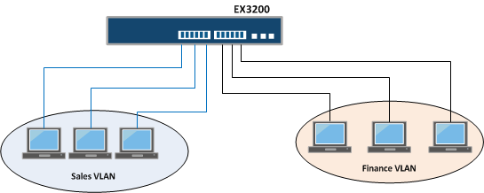

Using the image above as an example, VLAN is basically a way of saying:

> Sales devices can only talk to sales devices. Finance devices can only talk to finance devices. It’s like there are two separate switches.

An important benefit of this is security. Suppose that one computer is infected by a virus. Without VLAN, if that computer is connected to a switch, it could infect all of the other devices connected to that switch. With VLAN, the virus would basically be quarantined.

## Firewalls

Before going on an airplane, you have to go through TSA. TSA filters out dangerous passengers.


Before entering your home network, internet traffic has to go through a firewall. Firewalls filter out dangerous incoming traffic.


TSA has various criteria it uses to filter out dangerous passengers:

-   Race
-   Ethnicity
-   Skin color


Similarly, firewalls have various criteria they use to filter out dangerous traffic:

-   IP address
-   Protocol
-   Port number
-   etc.

See [http://computer.howstuffworks.com/firewall1.htm](http://computer.howstuffworks.com/firewall1.htm) for more info.

## NAT

We have a problem:

-   Every device needs it’s own IP address.
-   IP addresses are encoded with 32 bits.
-   There are 2³² ~ 4.3 billion combinations of 32 bits. Meaning, there’s about 4.3 billion possible IP addresses.
-   There are over 7 billion people in the world.
-   Some of these people don’t have devices that connect to the internet, but a lot of them do.
-   As society progresses, more and more people are getting internet access.
-   Of the people who do connect to the internet, a lot of them have many devices.
-   The devices that make up the infrastructure of the internet (routers, modems, servers, etc.) also need IP addresses.
-   Clearly, we’re running out of IP addresses!

When the internet was initially formed, they obviously didn’t realize it would become this big. Anyway, we need more IP addresses!

Or do we? A device called a [NAT](https://en.wikipedia.org/wiki/Network_address_translation) offers us a workaround, so perhaps not.

NAT is like a secretary. Instead of you sending your mail to the recipient, you send your mail to your secretary, and then _she_ sends it to the recipient. Now, you don’t really need a public address anymore. As long as people know how to find her and she knows how to find you, everything is cool.

Similarly, with a NAT, you don’t need an IP address anymore. You can send your requests through the NAT, and as long as the servers know the IP address of your NAT, they don’t need to know what your IP address is. And thus, you don’t need an IP address!

Here is how NATs work in a bit more detail:

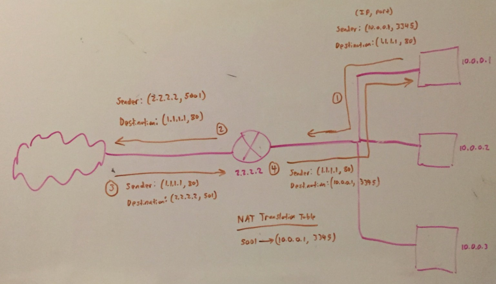

The NAT basically says:

> 10.0.0.1 wants to send a request to 2.2.2.2 at port 5001, and have the response be sent back to him at port 3345. Ok. I’ll send the request for him and pretend it’s coming from me. I’ll have the server send its response to my port 5001. And I’ll remember that whatever message I get from port 5001, it’s to be forwarded along to 10.0.0.1 at port 3345.

There are some issues with NATs though. A big one is that, since you don’t have a unique, public IP address, other devices can’t send unsolicited requests to you (they can only respond to your requests, which you send through the NAT). This makes things like P2P file sharing and Skype calls difficult.

However, there are certainly workarounds (otherwise, how would BitTorrent and Skype exist?). The one that I think is clean and cool is [UPnP](https://en.wikipedia.org/wiki/Universal_Plug_and_Play). Basically, you just tell your NAT:

> Any requests you get on port 4000 (or whatever), forward them to me.

Another option is to establish a connection with an intermediate, and have other people contact you through that intermediate (now that I type this, it sorta sounds like the same thing as UPnP except with a different intermediate).

The other issues with NATs are basically purists complaining that it’s hacky. Which is true.

The not-hacky solution to this is IPv6. IPv4 is what’s currently in use. It’s the thing that uses 32 bits for the IP address. IPv6 will use 128 bits. There are 38 zeros in 2¹²⁸. [We will never run out of addresses with IPv6. Ever.](https://itsnobody.wordpress.com/2012/02/17/how-many-addresses-can-ipv6-hold/)

It’s tough to transfer over to IPv6 though. Updating software is easy, but the routers and switches do stuff in hardware, so transferring over to IPv6 involves replacing hardware. Which is expensive. At the access network side of things, it’ll happen. Users buy new routers somewhat frequently. But at the network core side of things… there’s a shit ton of infrastructure that’d need upgrading.

Oh — if you’re wondering what happened to IPv5, basically, [there was an IPv5 already but it failed](http://softwareengineering.stackexchange.com/questions/185380/ipv4-to-ipv6-where-is-ipv5).

## Packet loss

You may have heard the term “packet loss”. Yes, it’s as bad as it sounds — sometimes, packets are lost (aka dropped).

Why does this happen? As an analogy, let’s think about the line at a restaurant:

-   If customers come in at a rate that the servers could handle, the process is seamless and no line accumulates.
-   If customers come in at a rate that the servers can’t handle, that’s ok — they just wait in line.
-   If customers are coming in so fast that the restaurant can’t fit everyone in the line, they have to turn customers away (assuming a line out the door isn’t possible, because it’s freezing outside). This is exactly what happens with packet loss.

The restaurant is analogous to a router, the line is analogous to the buffer in the router, and the customers are analogous to packets.

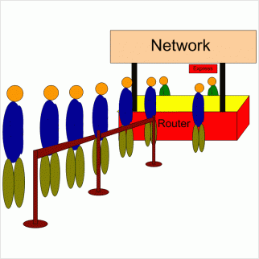

Packet loss can also happen simply because a wire breaks. Or because of interference with a wireless signal. Or because of a glitch in the router’s hardware. Or because of it’s software. There are lots of reasons.

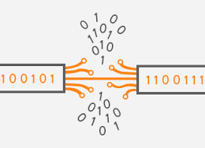

## Reliability

Given that packet loss is a thing… why hasn’t The Internet crumbled to the ground? Why don’t you see glitches in your videos, and gaps in your web pages?

## Retransmission

Short answer: retransmission. If a packet is lost, the recipient just asks the sender to resend it.

Ultimately, that’s all there is to it. However, detecting packet loss actually isn’t as easy as it may seem.

Consider an analogous situation: you’re on the phone with a customer service rep and are reading him your account number. You want to make sure he hears everything you said. What should you do?

It’s pretty simple — use **acknowledgements**:

-   When he hears you clearly, he responds by saying, “ok”.
-   When he doesn’t hear you clearly, he responds by saying, “could you repeat that?”.

> What if I mistakenly think I heard “ok” when the rep really didn’t hear the last number I said? Suppose my account number is 123456789 and the last number I said was 3. If the rep didn’t hear me and responded with “huh?”, and I respond with 4 because I think he did hear me, he’ll have an account number of 124 and I’ll think I have so far communicated an account number of 1234.

The solution to this is to use **sequence numbers**. Ie. “The first number is 1. The second number is 2. The third number is 3…”.

Here’s what would happen in the scenario you pose:

```
You: The third number is 3.Rep: Huh?You: The fourth number is 4.Rep: I didn’t hear what you said for the third number. Could you repeat the third number?You: Oh ok, I thought I heard you say, “ok” after I said the third number, but I must have misunderstood. Anyway, the third number is 3.
```

> What if I’m waiting a long time and haven’t heard the rep respond to the last number I said? It’s possible that he’s just taking a long time, but it’s also possible that his response was corrupted and I didn’t hear it.

Consider this scenario:

```
You: The third number is 3.Rep: Ok.You didn't hear him respond.You: ...Rep: ...
```

Then you guys would be stuck. You can’t reliably transfer data when you’re stuck like this.

The solution to this is to have some sort of **timeout interval**. For example, after 10 seconds or so, just repeat the last thing you said. It’s really the only sensible choice you have.

With these three things — acknowledgements, sequence numbers, and timeout intervals — we can have perfectly reliable data transmission!

## Congestion control

In addition to resending packets that are lost, we also try to prevent packet loss from happening in the first place. Basically, a router says:

> Hey, I could only handle 30 Mbps. I have one wire trying to send me 5 Mbps, another trying to send me 20, and another trying to send me 25. That’s more than I could handle. If you guys keep it up, my buffer is going to overflow and I’m going to have to start dropping packets.
> 
> So here’s what we’re going to do. I want to be fair. I think it’s fair that each of you is entitled to 10 Mbps each — an equal amount.  
> \- Wire A — you’re asking for less than 10 Mbps, so you’re entitled to keep sending me the 5 Mbps.  
> \- Wires B and C — you’re both asking for more than the 10 Mbps you’re entitled to. After giving 5 Mbps to Wire A, I have 25 Mbps left to allocate, which you’re both equally entitled to, so I’ll give each of you 12.5 Mbps.

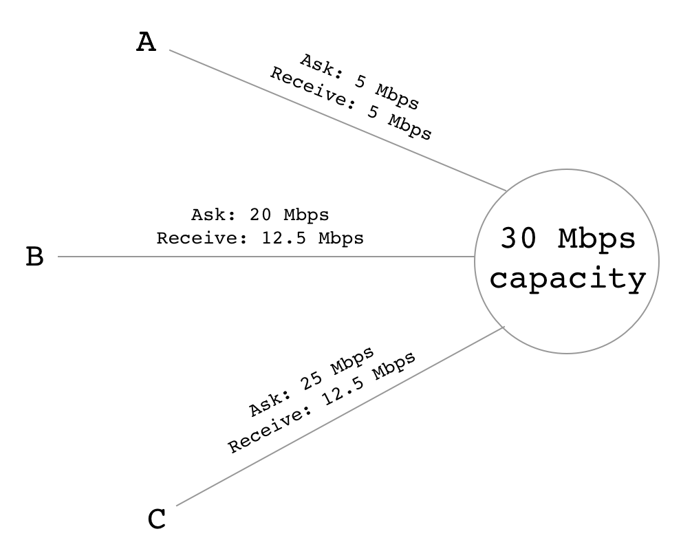

Well, that’s one way to do it. Different people have different ideas of what fairness is. Maybe C deserves some preference because it needs a lot more capacity.

## Fuck it

Sometimes applications just say:

> Fuck it. I don’t care if there’s packet loss.

These are usually multimedia applications. For example, consider an image like this one:


If a few pixels are off, it certainly isn’t going to screw up the image too badly. Furthermore, the end system may be able to infer what the missing pixels should be. For example, it wouldn’t take a genius to find the correct shade of blue for a missing pixel in the top left corner.

TCP is the protocol that is used for reliable transmission. UDP is the protocol that is used for unreliable transmission. Why would anyone choose UDP over TCP? Because it’s faster. In order to make things reliable, TCP requires that you wait for acknowledgements, include sequence numbers, etc. With UDP, you just blast away.

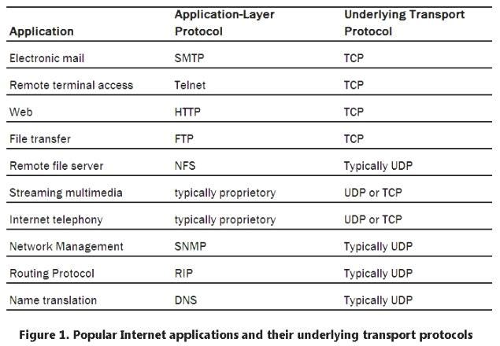

## Error detection

In the world of computer networking, reliability and error detection are different things. In the world of english, I wouldn’t consider something that doesn’t detect errors to be “reliable”, but unfortunately, bad vocabulary is something we have to deal with.

So, to be clear, if you transmit all the packets, and the sender receives them all in order, then it’s reliable. If some of the packets get corrupted and say “apple” instead of “banana”, it’s still considered reliable, but we say that there were errors.

When you think about it, error detection is pretty tough. Someone is sending you a message. You don’t know what they’re trying to send you. When you receive the message, how do you know if there’s an error? You may receive something that seems weird, but maybe it’s what they really did intend to send you.

## Context

In the real world, you can use context to become suspicious that there’s an error in the message. If you’re talking about a basketball game and someone tells you the score is 82–7a, you can infer that there was an error, because 7a is not a number.

From what I understand, error checking at the network level doesn’t do stuff like this (note: compilers for strongly typed programming languages do). I suppose that it would require the network layer to have a bunch of info about the “thing in the envelope”, which perhaps is overkill.

## Checksums

Checksums are one of the main tools that the network layer uses to detect errors. Here’s how they work:

Suppose I want to send “adam” to a server. Let’s say that a=1, d=4, and m=13. The sum of each digit is 1+4+1+13=19. So I’d send “adam\_19” to the server. 19 is the checksum.

Suppose the “d” gets corrupted and turns into an “e”. Then the server would receive “aeam\_19”. The server would then add up the digits to the left of the underscore: 1+5+1+13=20. Since the checksum it calculated isn’t equal to the checksum that was transmitted, it assumes the message is corrupted.

Note that the checksum approach is far from perfect:

-   What if the “d” got corrupted into an “e”, but the “19” also got corrupted into a “20”?
-   What if the “d” got corrupted into an “e”, but the “m” got corrupted into an “l”. Then the resulting checksum of “aeal” would be 19 too.

In practice, these types of glitches are possible, but the algorithms used are more advanced, and glitches are very unlikely. See [http://networkengineering.stackexchange.com/questions/39452/why-are-checksums-used-if-theyre-flawed](http://networkengineering.stackexchange.com/questions/39452/why-are-checksums-used-if-theyre-flawed) for more info.

## Privacy

Hackers can read what you send across the network. They can hack into the routers. They can intercept wireless signals. They have ways.

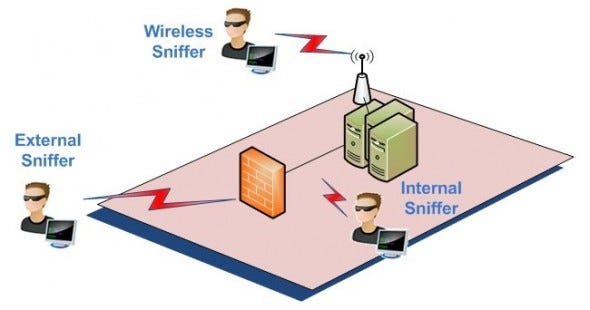

[http://www.valencynetworks.com/articles/cyber-security-attacks-network-sniffing.html](http://www.valencynetworks.com/articles/cyber-security-attacks-network-sniffing.html)

So, how can there be any privacy? Answer: with encryption! You encrypt at your end; the receiver decrypts at their end; people can still intercept and read your packets, but it’ll be encrypted, and thus it’ll look like gibberish to them.

See this video for a short description of how encryption works:

See [my article](https://medium.com/@adamzerner/encryption-b1937970ace5#.hesgyw4z7) for a longer one.

[[Index]] 

[[Basic of Networking - DevOps Training]]

[[Internet protocol - DevOps Training]] 

[[Basic of Networking - DevOps Training]]

[[OSI Model - DevOps Training]]

[[Network address and Host address - DevOps Training]] 

[[Subnetting Type - DevOps Training]]

[[Network Architecture - DevOps Training]] 

[[Networking Layers OSI Model - DevOps Training]] 

[[Internet protocol - DevOps Training]] 

[[CIDR and subnetting - DevOps Training]] 

[[AWS VPC - DevOps Training]] 

[[AWS VPC Subnets - DevOps Training]]