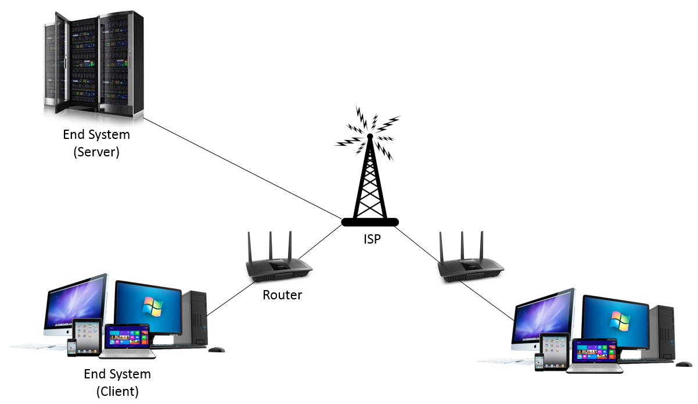
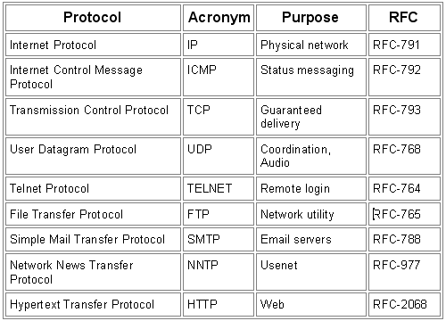
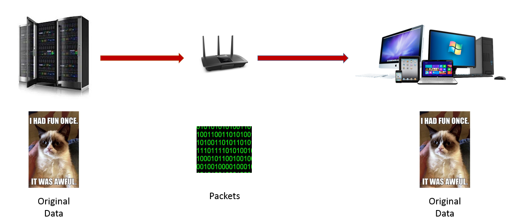
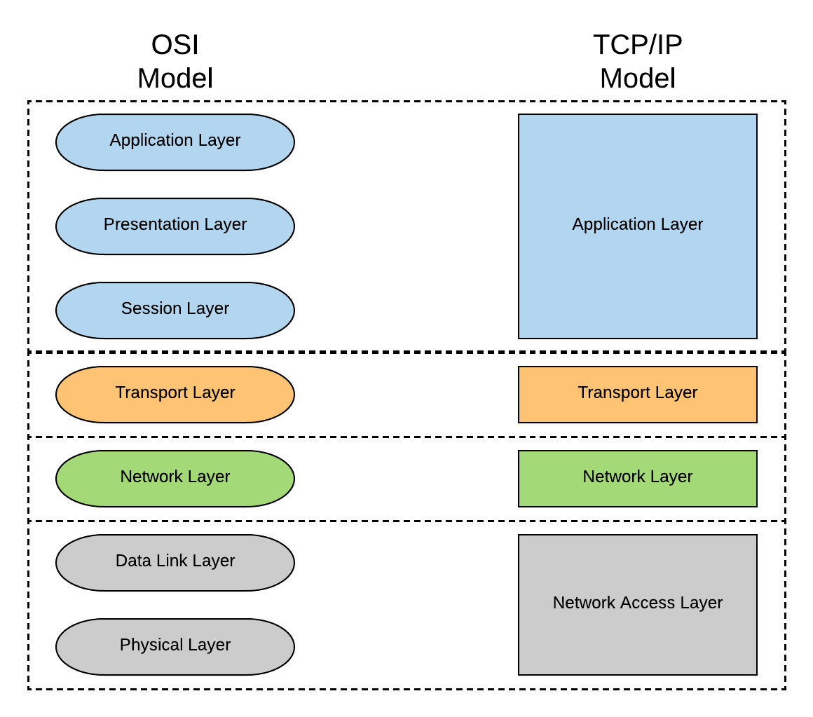
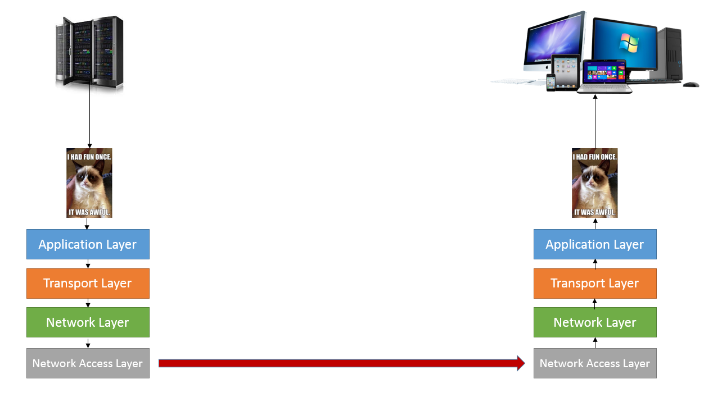

## 

[[Index]] 
 
[[Basic of Networking - DevOps Training]]

[[Internet protocol - DevOps Training]] 

[[Basic of Networking - DevOps Training]]

[[OSI Model - DevOps Training]]

[[Network address and Host address - DevOps Training]] 

[[Subnetting Type - DevOps Training]]

[[Network Architecture - DevOps Training]] 

[[Networking Layers OSI Model - DevOps Training]] 

[[Internet protocol - DevOps Training]] 

[[CIDR and subnetting - DevOps Training]] 

[[AWS VPC - DevOps Training]] 

[[AWS VPC Subnets - DevOps Training]]

Computer Networking?

By definition, a computer network is a group of computers that are linked together through a communication channel.Basic Computer Network Strucutre

All the computer devices are called **hosts** or **end systems**. Hosts sending requests are called **clients** while hosts receiving requests are called **servers**. End systems are connected together by a network of **communication links**and **packet switches**. Communication links are made up of different types of physical media, including coaxial cable, copper wide, optical fiber, and radio spectrum. Different links can transmit data at different rates, with the **transmission rate** of a link measured in bits/second. When one end system has data to send to another end system, the sending end system segments the data and adds header bytes to each segment. The resulting packages of information, known as **packets**, are then sent through the network to the destination end system, where they are reassembled into the original data. A packet switch takes a packet arriving on one of its incoming communication links and forwards that packet on one of its outgoing communication links. Common packet switches are **routers** and **link-layer switches**.

## 

Internet Protocols

End systems, packet switches and other pieces of the Internet run **protocols** that control the sending and receiving of information within the Internet. The **Transmission Control Protocol (TCP)** and the **Internet Protocol (IP)**are two of the most important protocols in the Internet. The IP protocol specifies the format of the packets that are sent and received among router and end systems. The Internet’s principal protocols are collectively known as **TCP/IP**.RFC Codes for Common Protocols

Given the importance of protocols to the Internet, it’s important that everyone agrees on what each and every protocol does, so that people can create systems and products that interoperate. Internet standards are developed by the **Internet Engineering Task Force (IETF)** into documents called **requests for comments (RFCs)**. RFCs tend to be quite technical and detailed. These define protocols such as TCP, IP, HTTP, DNS and SMTP. There are currently more than 6,000 RFCs.

## 

Layered Architecture

Internet Protocols are organized in a layered architecture. To explain this, let’s imagine you are trying to look for a meme from Google’s image search. The server has the image of your choice stored. Before the server sends out that information, it needs to convert that image into a package with all the necessary headers. Once it reaches the client, the reverse takes place. The packets have their headers removed in the reverse sequence and then converted back to the original data.Server to Client image transfer

Now, to take a step further and look at the individual protocol layers. Below are the common **TCP/IP model** and the more detailed **OSI model**. For our analogy (and probably the rest of the series), I will stick to the TCP/IP model.TCP/IP vs OSI Model

From the server to the internet, the sequence is top-down. When the server finds the Grumpy Cat image that the client requested, it will first convert it to a packet and add the **Application Layer** header. This protocol includes **HTTP** (which provides for Web document request and transfer), **SMTP**(which provides for transfer of e-mail messages), and **FTP** (which provides for the transfer of file between two end systems). After that, the **Transport Layer** protocol adds the necessary changes. This later transports application-layer messages between application endpoints. Common Transport Layer protocols are **TCP** (which provides connection-oriented services to its applications) and **UDP** (which provides connection-less services to its applications). The **Network Layer** comes right after. This protocol is responsible for moving network-layer packets or **datagrams** from one host to another. Finally, the **Network Access Layer** takes care of the transfer across the communication links. Once the server receives the package, the entire process takes place in reverse (bottom-up) to transform the packets back to the original image.Data Transformation Between End Systems

[[Index]] 
 
[[Basic of Networking - DevOps Training]]

[[Internet protocol - DevOps Training]] 

[[Basic of Networking - DevOps Training]]

[[OSI Model - DevOps Training]]

[[Network address and Host address - DevOps Training]] 

[[Subnetting Type - DevOps Training]]

[[Network Architecture - DevOps Training]] 

[[Networking Layers OSI Model - DevOps Training]] 

[[Internet protocol - DevOps Training]] 

[[CIDR and subnetting - DevOps Training]] 

[[AWS VPC - DevOps Training]] 

[[AWS VPC Subnets - DevOps Training]]