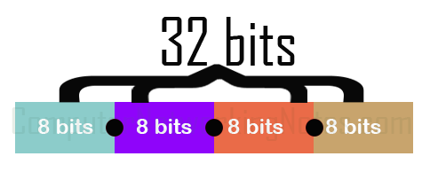
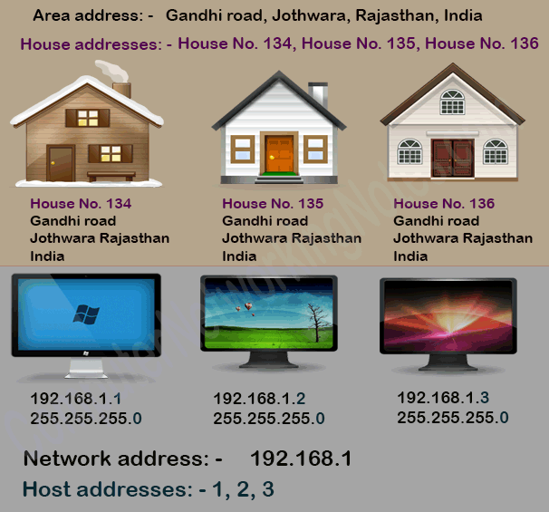
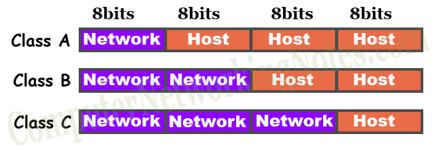
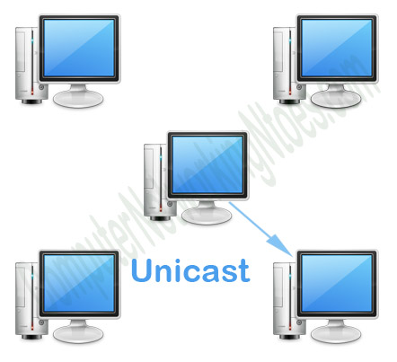
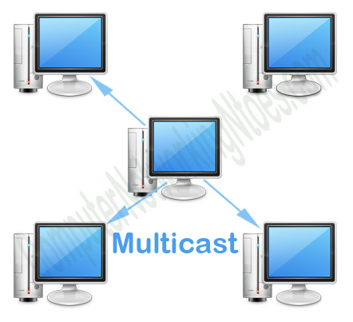
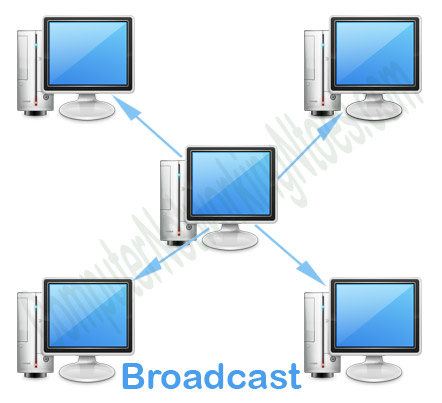

[[Index]] 
 
[[Basic of Networking - DevOps Training]]

[[Internet protocol - DevOps Training]] 

[[Basic of Networking - DevOps Training]]

[[OSI Model - DevOps Training]]

[[Network address and Host address - DevOps Training]] 

[[Subnetting Type - DevOps Training]]

[[Network Architecture - DevOps Training]] 

[[Networking Layers OSI Model - DevOps Training]] 

[[Internet protocol - DevOps Training]] 

[[CIDR and subnetting - DevOps Training]] 

[[AWS VPC - DevOps Training]] 

[[AWS VPC Subnets - DevOps Training]]

An IP address is a unique identity of an interface in IP network. IP addresses are just like postal addresses. In order to send and receive packages through postal system, every house needs a unique postal address. Just like it, in order to send and receive IP packets in IP network, every interface needs a unique IP address.

An IP address consists 32 bits. These bits are divided in four equal sections. Sections are separated by periods and written in a sequence.

In measurement, 8 bits are equal to one byte or octet. So we can also say an IP address consists four bytes or octets separated by periods.

Two popular notations are used for writing an IP address, binary and decimal.Advertisements

In binary notation, all four octets are written in binary format. For example, few IP addresses in binary format are listed below.

00001010.00001010.00001010.00001010

10101100.10101000.00000001.00000001

11000000.10101000.00000001.00000001

In decimal notation, all four octets are written in decimal format. A decimal equivalent value of the octet is used in each section. For example, IP addresses from above example are listed below in decimal format.

In real life you rarely need to write an IP address in binary format. But if you are preparing for any Cisco exam, I highly recommend you to learn the binary format along with the decimal format. Nearly all Cisco exams include questions about IP addresses. Learning both binary and decimal notations will help you in solving IP addressing related questions more effectively.

This tutorial is the first part of the article “**IP Subnetting in Computer Network Step by Step Explained with Examples**”. Other parts of this article are following.

_This tutorial is the second part of the article. It explains what Subnetting is and why it is necessary in computer network along with the advantages of Subnetting._

_This tutorial is the third part of the article. It explains the Subnetting concepts and terms such as network id, broadcast id, total hosts, valid hosts, power of 2, block size and CIDR in detail._

_This tutorial is the fourth part of the article. It explains how to solve or answer any Subnetting related question in less than a minute with 50+ Subnetting examples._

_This tutorial is the fifth part of the article. It explains what VLSM Subnetting is and how it is done step by step including differences between FLSM Subnetting and VLSM Subnetting._

_This tutorial is the sixth part of the article. It explains VLSM Subnetting examples for Cisco exams and interviews._

_This tutorial is the last part of the article. It explains Supernetting in detail with examples._

As we discussed earlier, an IP address is just like a postal address. Whether it is a postal address or an IP address, it contains two addresses, group address and individual address. In a particular group, the group address is common for all members and the individual address is unique for each member.

In postal system, group address and individual addresses are known as area address and house addresses. While in IP network, these addresses are known as network address and host addresses respectively.

Following figure shows few examples of addresses from both postal system and IP network.

IP address and subnet mask

In an IP address, how many bits are used in network address and how many bits are left for host address is determined by a subnet mask. Just like an IP address, subnet mask is also a 32 bits long address and can be written in both binary and decimal notations.

Examples of subnet mask in binary notation are following: -

11111111.00000000.00000000.00000000

11111111.11111111.00000000.00000000

11111111.11111111.11111111.00000000

Examples of subnet mask in decimal notation are following: -

IP address and subnet mask are always used together. Without IP address, subnet mask is just a number and vice versa. Few examples of writing IP address in correct way are listed below.

Examples of IP address with subnet mask in binary format

00001010.00001010.00001010.00001010

11111111.00000000.00000000.00000000

10101100.10101000.00000001.00000001

11111111.11111111.00000000.00000000

11000000.10101000.00000001.00000001

11111111.11111111.11111111.00000000

Examples of IP address with subnet mask in decimal format

There are 4,294,967,296 IP addresses. Based on following rules, IP addresses are categorized in five classes; A, B, C, D and E.Advertisements

-   In class A, first bit of the first byte always remains off (0).
    

-   In class B, first bit of first byte always remains on and the second bit of the first byte always remains off.
    

-   In class C, first two bits of first byte always remain on and the third bit of the first byte always remains off.
    

-   In class D, first three bits of first byte always remain on and the fourth bit of the first byte always remains off.
    

-   In class E, first four bits of first byte always remain on.
    

By turning all remaining bits of the first byte on and off, we can make first and last address of that class.

<table><tbody><tr data-rnwi-5xr8s6-dse9kg-2fw26j-10utlgm-focus-visible="true" data-rnwi-handle="table-row"><td>

Class

</td><td>

Starting bit(s) in binary

</td><td>

Decimal Value of first octet in range

</td></tr><tr data-rnwi-5xr8s6-dse9kg-2fw26j-10utlgm-focus-visible="true" data-rnwi-handle="table-row"><td>

A

</td><td>

0

</td><td>

0 to 127

</td></tr><tr data-rnwi-5xr8s6-dse9kg-2fw26j-10utlgm-focus-visible="true" data-rnwi-handle="table-row"><td>

B

</td><td>

10

</td><td>

128 to 191

</td></tr><tr data-rnwi-5xr8s6-dse9kg-2fw26j-10utlgm-focus-visible="true" data-rnwi-handle="table-row"><td>

C

</td><td>

110

</td><td>

192 to 223

</td></tr><tr data-rnwi-5xr8s6-dse9kg-2fw26j-10utlgm-focus-visible="true" data-rnwi-handle="table-row"><td>

D

</td><td>

1110

</td><td>

224 to 239

</td></tr><tr data-rnwi-5xr8s6-dse9kg-2fw26j-10utlgm-focus-visible="true" data-rnwi-handle="table-row"><td>

E

</td><td>

1111

</td><td>

240 to 255

</td></tr></tbody></table>

Class of an IP address is determined by the value of first byte or octet.

-   If value in first byte is in range **0 to 127**, it is a Class **A** address.
    

-   If value in first byte is in range **128 to 191**, it is a Class **B** address.
    

-   If value in first byte is in range **192 to 223**, it is a Class **C** address.
    

-   If value in first byte is in range **224 to 239**, it is a Class **D** address.
    

-   If value in first byte is in range **240 to 255**, it is a Class **E** address.
    

<table><tbody><tr data-rnwi-5xr8s6-dse9kg-2fw26j-10utlgm-focus-visible="true" data-rnwi-handle="table-row"><td>

Class

</td><td>

Starting Address

</td><td>

Ending Address

</td><td>

Subnet mask

</td></tr><tr data-rnwi-5xr8s6-dse9kg-2fw26j-10utlgm-focus-visible="true" data-rnwi-handle="table-row"><td>

A

</td><td>

0.0.0.0

</td><td>

127.255.255.255

</td><td>

255.0.0.0

</td></tr><tr data-rnwi-5xr8s6-dse9kg-2fw26j-10utlgm-focus-visible="true" data-rnwi-handle="table-row"><td>

B

</td><td>

128.0.0.0

</td><td>

191.255.255.255

</td><td>

255.255.0.0

</td></tr><tr data-rnwi-5xr8s6-dse9kg-2fw26j-10utlgm-focus-visible="true" data-rnwi-handle="table-row"><td>

C

</td><td>

192.0.0.0

</td><td>

223.255.255.255

</td><td>

255.255.255.0

</td></tr><tr data-rnwi-5xr8s6-dse9kg-2fw26j-10utlgm-focus-visible="true" data-rnwi-handle="table-row"><td>

D

</td><td>

224.0.0.0

</td><td>

239.255.255.255

</td><td>

Not applicable

</td></tr><tr data-rnwi-5xr8s6-dse9kg-2fw26j-10utlgm-focus-visible="true" data-rnwi-handle="table-row"><td>

E

</td><td>

240.0.0.0

</td><td>

255.255.255.255

</td><td>

Not applicable

</td></tr></tbody></table>

Although we have nearly 4.3 billion IP addresses but not all are available for end devices. From these addresses, following addresses are reserved and cannot be assigned to end devices.

-   **0.0.0.0**:- This address represents all networks.
    

-   **127.0.0.0 to 127.255.255.255**: - This IP range is reserved for loopback testing.
    

-   **224.0.0.0 to 239.255.255.255 (Class D)**: - This IP class is reserved for multicast.
    

-   **240.0.0.0 to 255.255.255.254 (Class E)**: - This IP class is reserved for future use.
    

-   **255.255.255.255**: - This address represents all hosts.
    

Besides these reserved address, we also cannot use the first and the last IP address of each network. First IP address is reserved for the network address and last IP address is reserved for the broadcast address. We can use only the addresses available between the network address and the broadcast address for end devices.

#### 

IP address vs Network Address

As discussed, an IP address is the combination of two separate addresses, network address and host address. If we exclude host address from IP address, we will get network address. In simple term, a network address is an IP address without host address. In technical term, a network address is an IP address in which all host bits are turned off.

We can only turn on or off host bits. We cannot turn on or off reserved network bits. In class A, B and C first 8, 16 and 24 bits are reserved respectively for network addresses.

network bits and host bits

#### 

IP address vs Host Address

Any IP operation such as building a network address or host address and Subnetting are always performed in the host portion of an IP address. We can turn on and off host bits as per our requirement. In class A, B and C last 24 bits, 16 bits and 8 bits are defined as host bits respectively.

#### 

Private IP addresses vs Public IP addresses

In class A, B and C following IP addresses are defined as private IP addresses:-

-   In class A: - 10.0.0.0 to 10.255.255.255
    

-   In class B: - 172.16.0.0 to 172.31.255.255
    

-   In class C: - 192.168.0.0 to 192.168.255.255
    

Except private IP addresses and reserved IP addresses, all remaining IP addresses of Class A, B and C are considered as public IP addresses.

Public IP addresses are used in public network such as Internet. Public IP addresses are maintained and regulated by ICANN (Internet Corporation for Assigned Names and Numbers).

Private IP addresses are used in private network. Private IP addresses are locally significant and not routable in public network.

There are three types of network address; unicast, multicast and broadcast.

Unicast address represents an individual end device. If an IP packet is sent on a unicast address, it is intended only for that particular recipient. Unicast addresses are usually used by end devices for end to end communication.

Multicast address represents a group of devices. If an IP packet is sent on a multicast address, it is intended for all members of that group. Multicast addresses are usually used by networking devices for running their own services.

Broadcast address represents all devices of the network. If an IP packet is sent on a broadcast address, it is intended for all devices of that network. Broadcast addresses are usually used to locate hosts or services in network.

[[Index]] 
 
[[Basic of Networking - DevOps Training]]

[[Internet protocol - DevOps Training]] 

[[Basic of Networking - DevOps Training]]

[[OSI Model - DevOps Training]]

[[Network address and Host address - DevOps Training]] 

[[Subnetting Type - DevOps Training]]

[[Network Architecture - DevOps Training]] 

[[Networking Layers OSI Model - DevOps Training]] 

[[Internet protocol - DevOps Training]] 

[[CIDR and subnetting - DevOps Training]] 

[[AWS VPC - DevOps Training]] 

[[AWS VPC Subnets - DevOps Training]]