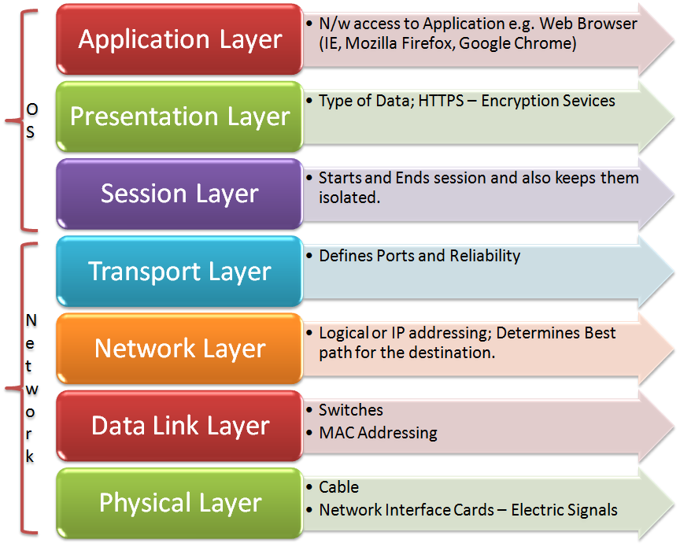
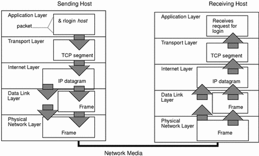

[[Index]] 
 
[[Basic of Networking - DevOps Training]]

[[Internet protocol - DevOps Training]] 

[[Basic of Networking - DevOps Training]]

[[OSI Model - DevOps Training]]

[[Network address and Host address - DevOps Training]] 

[[Subnetting Type - DevOps Training]]

[[Network Architecture - DevOps Training]] 

[[Networking Layers OSI Model - DevOps Training]] 

[[Internet protocol - DevOps Training]] 

[[CIDR and subnetting - DevOps Training]] 

[[AWS VPC - DevOps Training]] 

[[AWS VPC Subnets - DevOps Training]]

The Open System Interconnection model (OSI) is a seven layer model used to visualize computer networks. The OSI model is often viewed as complicated and many fear having to learn the model. However, the OSI model is an extremely useful tool for development and problem solving. Each of the seven layers goes up in increments of one as it gets closer to the human user. Layer one — the application layer, is closest to the person while layer seven — the physical layer is where the network receives and transmits raw data. The OSI model belongs to the International Organization for Standards (ISO) and is maintained by the identification ISO/IEC 7498–1. In this post, each of the seven layers of the OSI model will be explained in simple terms. The layers will be explained from layer seven to layer one, as this is where the data flow starts.

## 

The seven layers of the OSI model in depth

The application layer is where the user inputs data and data is output to the user. The application layer is usually software that is run off the local machine, however this depends on the network architecture. The software could be cloud based, meaning it runs off a server in a remote location and data is transferred over the internet, or the software could be run on a local server. The application layer provides services for email, Telnet and file Transfer for example. An example of the application layer is an internet browser, an FTP client or even Microsoft Word.

The presentation layer is where the operating system lies. This operating system could be Windows, OS X, a Unix based operating system or one of the many others available. Where the human user interacts with the application layer described above, the application layer interacts with the presentation layer. This may be done directly, or through a runtime environment such as the Java Runtime Environment (JRE).

The session layer is responsible for creating and maintaining sessions between the operating system on the presentation layer and other, third party machines. For example, when a user is browsing the internet, they are interacting with the application layer, the application layer is interacting with the presentation layer and the session layer allows the operating system to interact with the web server.

The transport layer is responsible for the logistics of the session. In the example used above, the transport layer would be responsible for determining what and how much information is transferred between the operating system and the web server.

The network layer is where routers operate. A router is a hardware device that forwards packets of information between computers on a network. This is where your IP address comes from and in the example used above, the router is responsible for sending packets of information out into the internet and receiving them. These packets origin and destination is determined by the IP address of your router.

The data link layer is where switches operate and provides a reliable link between two directly connected nodes. The data link layer is also responsible for detecting and possibly fixing any packet errors that may form on the physical layer. The data link layer is divided into two separate layers, the Media Access Control (MAC) and Logical Link Control (LLC) layers. The MAC layer is responsible for controlling how devices connected to the network gain access. The LLC layer controls error checking, possible fixes and packet synchronization.

The physical layer is literally the physical hardware that makes up the network. This layer has several major functions:

-   Defining physical specifications
    

-   Defining transmission mode (half duplex & full duplex)
    

-   Defining the network’s topology
    

Hardware such as the physical components of Ethernet cables and Bluetooth are just some examples of the physical layer.

## 

Data Encapsulation and the TCP/IP Protocol Stack

First to understand these terms, the definitions are listed below:

-   **TCP** — is the transport protocol that manages the individual conversations. TCP divides the HTTP messages into smaller pieces, called segments. These segments are sent between the web server and client processes running at the destination host. TCP is also responsible for controlling the size and rate at which messages are exchanged between the server and the client.
    

-   **IP** — is responsible for taking the formatted segments from TCP, encapsulating them into packets, assigning them the appropriate addresses, and delivering them to the destination host.\\
    

-   **protocol** **suite**\- a set of protocols that work together to provide comprehensive network communication services. A protocol suite may be specified by a standards organization or developed by a vendor. Protocol suites, can be a bit overwhelming.
    

-   **Data encapsulation**, also known as **data** hiding, is the mechanism whereby the implementation details of a class are kept hidden from the user. The user can only perform a restricted set of operations on the hidden members of the class by executing special functions commonly called methods.
    

-   **TCP/IP protocol suite** an open standard, meaning these protocols are freely available to the public, and any vendor is able to implement these protocols on their hardware or in their software.
    

The packet is the basic unit of information transferred across a network, consisting, at a minimum, of a header with the sending and receiving hosts’ addresses, and a body with the data to be transferred. As the packet travels through the TCP/IP protocol stack, the protocols at each layer either add or remove fields from the basic header. When a protocol on the sending host adds data to the packet header, the process is called data encapsulation. Moreover, each layer has a different term for the altered packet, as shown in the following figure.How a Packet Travels Through the TCP/IP Stack

This section summarizes the life cycle of a packet from the time the user issues a command or sends a message to the time it is received by the appropriate application on the receiving host.

The application layer has 5 sections of protocols with the listed protocols in place:

-   **Domain name system-** translates domain names, such as cisco.com, into IP addresses
    

-   Dynamic Host config protocol
    

-   Simple mail transfer protocol
    

-   Trivial File transfer protocol
    

-   Hypertext transfer protocol
    

In the **Transport layer** there is-

-   Transmission control protocol
    

in the **Internet layer** there are two sections-

-   Network address translation
    

-   Internet control message protocol
    

-   Enhanced interior gateway routing protocol
    

Lastly, in the **Network Access Layer** there is-

-   Enhanced interior gateway routing protocol
    

-   Address resolution protocol
    

The individual protocols are organized in layers using the TCP/IP protocol model: Application, Transport, Internet, and Network Access Layers. TCP/IP protocols are specific to the Application, Transport, and Internet layers. The network access layer protocols are responsible for delivering the IP packet over the physical medium. These lower layer protocols are developed by various standards organizations.

The TCP/IP protocol suite is implemented as a TCP/IP stack on both the sending and receiving hosts to provide end-to-end delivery of applications over a network. The Ethernet protocols are used to transmit the IP packet over the physical medium used by the LAN

[[Index]] 
 
[[Basic of Networking - DevOps Training]]

[[Internet protocol - DevOps Training]] 

[[Basic of Networking - DevOps Training]]

[[OSI Model - DevOps Training]]

[[Network address and Host address - DevOps Training]] 

[[Subnetting Type - DevOps Training]]

[[Network Architecture - DevOps Training]] 

[[Networking Layers OSI Model - DevOps Training]] 

[[Internet protocol - DevOps Training]] 

[[CIDR and subnetting - DevOps Training]] 

[[AWS VPC - DevOps Training]] 

[[AWS VPC Subnets - DevOps Training]]