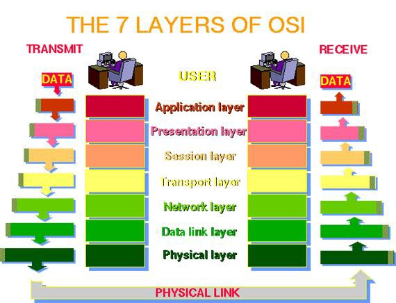

[[Index]] 
 
[[Basic of Networking - DevOps Training]]

[[Internet protocol - DevOps Training]] 

[[Basic of Networking - DevOps Training]]

[[OSI Model - DevOps Training]]

[[Network address and Host address - DevOps Training]] 

[[Subnetting Type - DevOps Training]]

[[Network Architecture - DevOps Training]] 

[[Networking Layers OSI Model - DevOps Training]] 

[[Internet protocol - DevOps Training]] 

[[CIDR and subnetting - DevOps Training]] 

[[AWS VPC - DevOps Training]] 

[[AWS VPC Subnets - DevOps Training]]

The purpose of the OSI reference model is to guide vendors and developers so the digital communication products and software programs they create will interoperate, and to facilitate clear comparisons among communications tools. Most vendors involved in telecommunications make an attempt to describe their products and services in relation to the OSI model. Moreover, it is critically very important for an IT professional to have a clear idea about the OSI Model. This is due to the fact that, in case of some network problems, using the OSI Layers, they can narrow down and figure out in which part the problem is. So having an OSI Layered approach for troubleshooting network problems is a very useful.

-   It creates a common platform for software developers and hardware manufactures that encourage the creation of networking products that can communicate with each other over the network.
    

-   It helps network administrators by dividing large data exchange process in smaller segments.
    

-   Due to the independence of layers, it prevents changes in one layer from affecting other layers.
    

-   Standardization of network components allows multiple-vendor development.
    

-   It structures very well the functions particular to each layer.
    

-   It reduces complexity and accelerates evolution
    

-   It simplifies teaching and learning
    

## 

Seven Layers Of OSI Model

As discussed in the previous section, the OSI Model is composed of seven layers with the application layer, which is closest to the end user, at the top, going all the way down to physical layer, in which the actual data transfer happens with the use of a transmission medium.

This is the topmost layer in the seven OSI Layers. This is the layer that the end-user (can be a computer programmer, or a regular PC user) is actually interacting with. This layer allows access to network resources.

This is the layer in which the operating system operates with the data. Main functions of this layers includes translation, encryption and compression of data. Basically User interacts with Application layer, which sends the data down to Presentation layer.

This layer has the job of maintaining proper communication by establishing, managing and terminating sessions between two computers. For example, whenever we visit any website, our computer has to create a session with the web server of that website.

This layer has a very important job. It decides how much information should be sent at a time. So, when you are communicating with a website, this layer will decide how much data you can transfer and receive at a given point of time. Also, this layer provides reliable process to process message delivery and error recovery.

The main job of this layer is to move packets from source to destination and provide inter-networking. This is the layer that the routers operate on. Since routers operate at the network level, hence we can say that the IP address is at the network level.

This layer is responsible for organizing bits into frames and ensuring hop to hop delivery. This is the layer on which the Switches operate on. Since routers operate at the network level, hence we can say that the MAC address resides at the data link layer. All the computers in a specific network get plugged into a switch so that they can communicate with each other.

This is the layer on which the real transmission of data bits takes place through a medium. This layer is, as the name suggests, all the physical stuff that connects the computers together

This was a short and to the point article explaining the OSI Model, to help out all those who are having hard time understanding the model. Hope it will help you understand the OSI model, in case you are stuck and trying to by-heart and cram the OSI Layers.

[[Index]] 
 
[[Basic of Networking - DevOps Training]]

[[Internet protocol - DevOps Training]] 

[[Basic of Networking - DevOps Training]]

[[OSI Model - DevOps Training]]

[[Network address and Host address - DevOps Training]] 

[[Subnetting Type - DevOps Training]]

[[Network Architecture - DevOps Training]] 

[[Networking Layers OSI Model - DevOps Training]] 

[[Internet protocol - DevOps Training]] 

[[CIDR and subnetting - DevOps Training]] 

[[AWS VPC - DevOps Training]] 

[[AWS VPC Subnets - DevOps Training]]