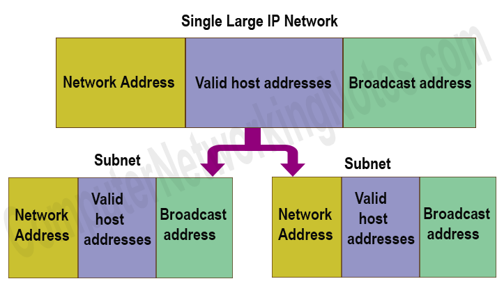

[[Index]] 
 
[[Basic of Networking - DevOps Training]]

[[Internet protocol - DevOps Training]] 

[[Basic of Networking - DevOps Training]]

[[OSI Model - DevOps Training]]

[[Network address and Host address - DevOps Training]] 

[[Subnetting Type - DevOps Training]]

[[Network Architecture - DevOps Training]] 

[[Networking Layers OSI Model - DevOps Training]] 

[[Internet protocol - DevOps Training]] 

[[CIDR and subnetting - DevOps Training]] 

[[AWS VPC - DevOps Training]] 

[[AWS VPC Subnets - DevOps Training]]

IP Subnetting is a process of dividing a large IP network in smaller IP networks. In Subnetting we create multiple small manageable networks from a single large IP network.

To best utilize available addresses if we put more than 16000000 hosts in a single network, due to broadcast and collision, that network will never work. If we put less hosts then remaining addresses will be wasted.

Subnetting provides a better way to deal with this situation. Subnetting allows us to create smaller networks from a single large network which not only fulfill our hosts’ requirement but also offer several other networking benefits.

I have already explained the advantages of Subnetting along with why Subnetting is necessary in previous parts of this tutorial. In this part, I will mainly focus on Subnetting components and terminology.

This tutorial is the third part of the article “**IP Subnetting in Computer Network Step by Step Explained with Examples**”. Other parts of this article are following.

_This tutorial is the last part of the article. It explains Supernetting in detail with examples._

#### 

Network portion vs Host portion

Identifying network portion and host portion in an IP address is the first step of Subnetting. Subnetting can only be done in host portion. Subnet mask is used to distinguish the network portion from host portion in an IP address.

An IP address and a subnet mask both collectively provide a numeric identity to an interface. Both addresses are always used together. Without subnet mask, an IP address is an ambiguous address and without IP address a subnet mask is just a number.

Both addresses are 32 bits in length. These bits are divided in four parts. Each part is known as octet and contains 8 bits. Octets are separated by periods and written in a sequence.

Subnet mask assigns an individual bit for each bit of IP address. If IP bit belongs to network portion, assigned subnet mask bit will be turned on. If IP bit belongs to host portion, assigned subnet mask bit will be turned off.

There are two popular notations to write the IP address and Subnet mask; Decimal notation and Binary notation.

In decimal notation, a value range 1 to 255 represents a turned on bit while a value 0 (zero) represents a turned off bit.

IP address with subnet mask decimal notation

In binary notation, 1 (one) represents a turned on bit while 0 (zero) represents a turned off bit.

ip address in binary notation

Examples of IP address with subnet mask in binary format

00001010.00001010.00001010.00001010

11111111.00000000.00000000.00000000

10101100.10101000.00000001.00000001

11111111.11111111.00000000.00000000

11000000.10101000.00000001.00000001

11111111.11111111.11111111.00000000

Examples of IP address with subnet mask in decimal format

In above examples network portion is formatted in bold text.

#### 

Reserve IP classes, network bits and host bits

Each IP address belongs to a predefined IP class. There are five predefined IP classes; A, B, C, D and E. From these classes, class D and E are reserved and cannot be used in Subnetting.

To learn more about IP address and its classes, you can see this tutorial.

_It explains IP address, IP classes, Types of IP address, Private IP address, Public IP address and much more in detail._

-   First 8, 16 and 24 bits are reserved for network portion respectively.
    

-   Last 2 bits (31 & 32) are reserved for host portion.
    

Reserved network bits and host bits cannot be used in Subnetting.

<table><tbody><tr data-rnwi-5xr8s6-dse9kg-2fw26j-10utlgm-focus-visible="true" data-rnwi-handle="table-row"><td>

IP Class

</td><td>

First IP Address of class

</td><td>

Last IP Address of class

</td><td>

Default Subnet Mask

</td><td>

Default Network bits

</td><td>

Host bits

</td><td>

Reserved host bits

</td></tr><tr data-rnwi-5xr8s6-dse9kg-2fw26j-10utlgm-focus-visible="true" data-rnwi-handle="table-row"><td>

A

</td><td>

0.0.0.0

</td><td>

127.255.255.255

</td><td>

255.0.0.0

</td><td>

First 8 bits

</td><td>

9 to 30

</td><td>

31, 32

</td></tr><tr data-rnwi-5xr8s6-dse9kg-2fw26j-10utlgm-focus-visible="true" data-rnwi-handle="table-row"><td>

B

</td><td>

128.0.0.0

</td><td>

191.255.255.255

</td><td>

255.255.0.0

</td><td>

First 16 bits

</td><td>

17 to 30

</td><td>

31, 32

</td></tr><tr data-rnwi-5xr8s6-dse9kg-2fw26j-10utlgm-focus-visible="true" data-rnwi-handle="table-row"><td>

C

</td><td>

192.0.0.0

</td><td>

223.255.255.255

</td><td>

255.255.255.0

</td><td>

First 24 bits

</td><td>

25 to 30

</td><td>

31, 32

</td></tr></tbody></table>

#### 

Subnetting eligible host bits

After excluding reserved network bits and host bits, remaining bits are considered as Subnetting eligible host bits.

Subnetting can be done only in Subnetting eligible bits.

A subnet is a single small network created from a large network. In Subnetting we break a single large network in multiple small networks. These networks are known as subnets.

#### 

Network address and Broadcast address

In each network there are two special addresses; network address and broadcast address. Network address represents the network itself while broadcast address represents all the hosts which belong to it. These two addresses can’t be assigned to any individual host in network. Since each subnet represents an individual network, it also uses these two addresses.

In simple language, in a single network only two IP addresses will be used for these addresses. But if we breaks this network in two small networks then four IP addressed will be used for these addresses.

network address broadcast address

Network address and broadcast address are also known as Network ID and broadcast ID respectively.

All addresses between Network address and Broadcast address are known as valid host addresses. Only valid host addresses can be assigned to the devices in a network. These devices include end user devices such as computes, laptops, tablets, smartphones, IP phones, servers, printers, terminals, IP camera and networking devices such switches, routers, firewalls and proxy servers. In short, any device that uses IP protocol for data transferring needs a valid host address.

Block size is the sum of network address, valid host addresses and broadcast address. For example, if in a network there are 6 valid hosts than block size of that network is 8 (1 network address + 6 valid hosts + 1 broadcast address).

An IP address is built from the various combinations of IP bits. Understanding how many combinations the number of bits provides or to get the number of combinations how many bits we need is the second essential step of Subnetting.

-   A combination of all 32 represents a unique IP address.
    

-   A combination of network bits in IP address represents the number of networks or subnets.
    

-   A combination of host bits in IP address represents the number of total hosts.
    

To know how many combinations the number of bits provides or to get the number of combinations how many bits are required, we use the power of 2.

For example, to break a single large network in 4 subnets, we need 2 (22 = 4) Subnetting bits. This way if we have 3 Subnetting bits, we can make 8 (23 = 8) additional networks.

Following table lists the power of 2 till 32.

<table><tbody><tr data-rnwi-5xr8s6-dse9kg-2fw26j-10utlgm-focus-visible="true" data-rnwi-handle="table-row"><td>

2X

</td><td>

Value

</td><td>

2X

</td><td>

Value

</td><td>

2X

</td><td>

Value

</td><td>

2X

</td><td>

Value

</td></tr><tr data-rnwi-5xr8s6-dse9kg-2fw26j-10utlgm-focus-visible="true" data-rnwi-handle="table-row"><td>

1

</td><td>

2

</td><td>

9

</td><td>

512

</td><td>

17

</td><td>

131072

</td><td>

25

</td><td>

33554432

</td></tr><tr data-rnwi-5xr8s6-dse9kg-2fw26j-10utlgm-focus-visible="true" data-rnwi-handle="table-row"><td>

2

</td><td>

4

</td><td>

10

</td><td>

1024

</td><td>

18

</td><td>

262144

</td><td>

26

</td><td>

67108864

</td></tr><tr data-rnwi-5xr8s6-dse9kg-2fw26j-10utlgm-focus-visible="true" data-rnwi-handle="table-row"><td>

3

</td><td>

8

</td><td>

11

</td><td>

2048

</td><td>

19

</td><td>

524288

</td><td>

27

</td><td>

134217728

</td></tr><tr data-rnwi-5xr8s6-dse9kg-2fw26j-10utlgm-focus-visible="true" data-rnwi-handle="table-row"><td>

4

</td><td>

16

</td><td>

12

</td><td>

4096

</td><td>

20

</td><td>

1048576

</td><td>

28

</td><td>

268435456

</td></tr><tr data-rnwi-5xr8s6-dse9kg-2fw26j-10utlgm-focus-visible="true" data-rnwi-handle="table-row"><td>

5

</td><td>

32

</td><td>

13

</td><td>

8192

</td><td>

21

</td><td>

2097152

</td><td>

29

</td><td>

536870912

</td></tr><tr data-rnwi-5xr8s6-dse9kg-2fw26j-10utlgm-focus-visible="true" data-rnwi-handle="table-row"><td>

6

</td><td>

64

</td><td>

14

</td><td>

16384

</td><td>

22

</td><td>

4194304

</td><td>

30

</td><td>

1073741824

</td></tr><tr data-rnwi-5xr8s6-dse9kg-2fw26j-10utlgm-focus-visible="true" data-rnwi-handle="table-row"><td>

7

</td><td>

128

</td><td>

15

</td><td>

32768

</td><td>

23

</td><td>

8388608

</td><td>

31

</td><td>

2147483648

</td></tr><tr data-rnwi-5xr8s6-dse9kg-2fw26j-10utlgm-focus-visible="true" data-rnwi-handle="table-row"><td>

8

</td><td>

256

</td><td>

16

</td><td>

65536

</td><td>

24

</td><td>

16777216

</td><td>

32

</td><td>

4294967296

</td></tr></tbody></table>

In 2X the X is the number of bits.

Subnetting always flows in single direction (left to right) without skipping any bit. This simple rule gives us the exact location of Subnetting bits in an address space. Let’s take an example.

A class C network is subnetted in 4 subnets. Find the number of host bits used in Subnetting and their location in address space.

To create 4 subnets we need to 2 (22 = 4) Subnetting eligible host bits.

Since in class C network space Subnetting eligible bits starts from 25 and Subnetting always goes from left to right without skipping any bit, the bits used in this network are 25 and 26.

It’s a compact representation of Subnet mask. In this notation a slash (/) sign and total number of the on bits in subnet mask are written with IP address instead of full Subnet mask.

Following table lists some examples of IP addresses with Subnet mask in all three notations.

<table><tbody><tr data-rnwi-5xr8s6-dse9kg-2fw26j-10utlgm-focus-visible="true" data-rnwi-handle="table-row"><td>

In Slash notation

</td><td>

In binary notation

</td><td>

In decimal notation

</td></tr><tr data-rnwi-5xr8s6-dse9kg-2fw26j-10utlgm-focus-visible="true" data-rnwi-handle="table-row"><td>

10.10.10.10/8

</td><td>

00001010.00001010.00001010.00001010 11111111.00000000.00000000.00000000

</td><td>

10.10.10.10 255.0.0.0

</td></tr><tr data-rnwi-5xr8s6-dse9kg-2fw26j-10utlgm-focus-visible="true" data-rnwi-handle="table-row"><td>

172.168.1.1/16

</td><td>

10101100.10101000.00000001.00000001 11111111.11111111.00000000.00000000

</td><td>

172.168.1.1 255.255.0.

</td></tr><tr data-rnwi-5xr8s6-dse9kg-2fw26j-10utlgm-focus-visible="true" data-rnwi-handle="table-row"><td>

192.168.1.1/24

</td><td>

11000000.10101000.00000001.00000001 11111111.11111111.11111111.00000000

</td><td>

192.168.1.1 255.255.255.0

</td></tr><tr data-rnwi-5xr8s6-dse9kg-2fw26j-10utlgm-focus-visible="true" data-rnwi-handle="table-row"><td>

192.168.1.1/28

</td><td>

11000000.10101000.00000001.00000001 11111111.11111111.11111111.11110000

</td><td>

192.168.1.1 255.255.255.240

</td></tr></tbody></table>

There are two types of Subnetting FLSM and VLSM. In FLSM, all subnets have equal number of host addresses and use same Subnet mask. In VLSM, subnets have flexible number of host addresses and use different subnet mask.

Following figure shows an example of FLSM and VLSM.

FLSM is easy in implementation and simple in operation but wastes a lot of IP addresses. VLSM is hard in implementation and complex in operation but utilizes maximum IP addresses.

 [[Index]] 
 
[[Basic of Networking - DevOps Training]]

[[Internet protocol - DevOps Training]] 

[[Basic of Networking - DevOps Training]]

[[OSI Model - DevOps Training]]

[[Network address and Host address - DevOps Training]] 

[[Subnetting Type - DevOps Training]]

[[Network Architecture - DevOps Training]] 

[[Networking Layers OSI Model - DevOps Training]] 

[[Internet protocol - DevOps Training]] 

[[CIDR and subnetting - DevOps Training]] 

[[AWS VPC - DevOps Training]] 

[[AWS VPC Subnets - DevOps Training]]